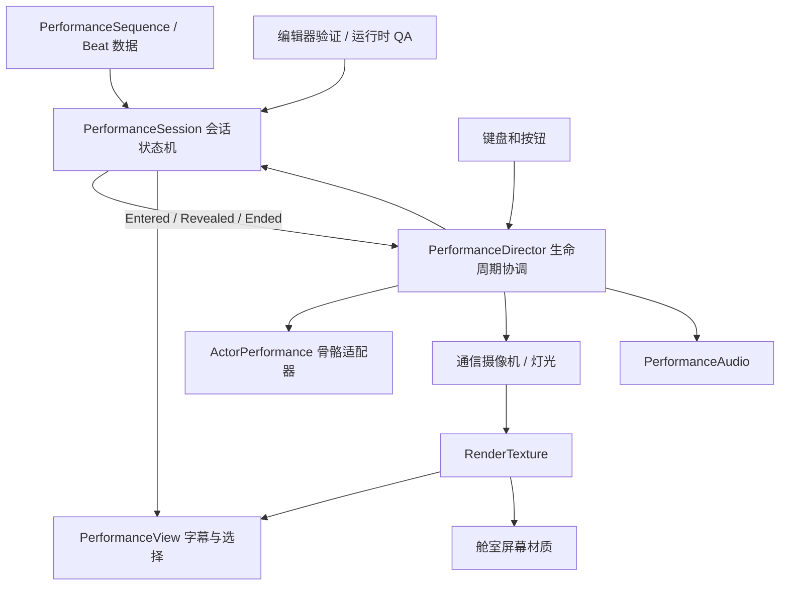
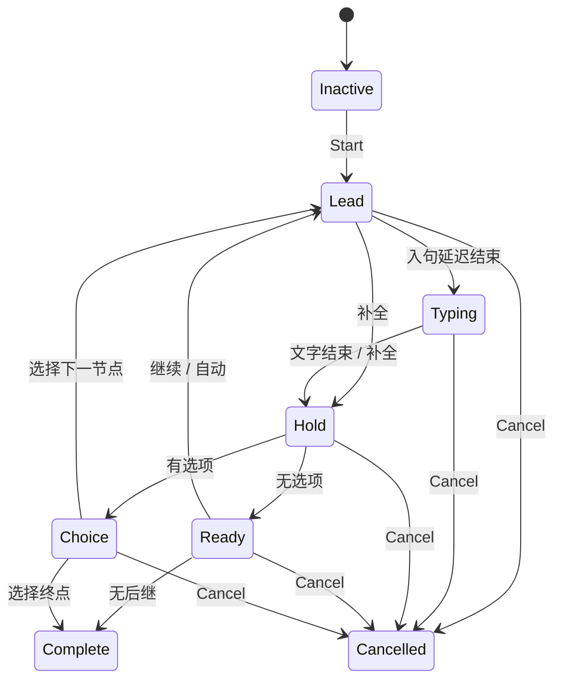

# 技术设计与代码架构

## 1. 与现有工程兼容的选择

保持 Unity 2022.3.62f1、Built-in Render Pipeline、C#、Windows standalone。此次是独立工程，可以从 `UnityProject` 打开，或直接运行 `Build/ASTRA Performance.exe`。没有依赖 Cinemachine、Timeline、第三方对话插件或在线服务；不需要访问正式游戏存档。

对话内容采用 `PerformanceSequence : ScriptableObject`；初次构建生成 `Data/SignalArchive.asset`，后续重建保留作者在 Inspector 中修改的内容。新增一行对白不需要修改播放器源码。

## 2. 依赖图



| 文件/模块 | 责任 | 禁止承担 |
|---|---|---|
| Core/PerformanceSequence.cs | 可序列化节拍、角色/姿态/视线枚举、分支 | 输入、逐帧动画 |
| Core/PerformanceSession.cs | 计时、文字推进、选择、暂停、中断；发出语义事件 | 相机、音源、Transform、Input、Time API |
| Runtime/PerformanceDirector.cs | 创建会话、订阅事件、角色切换、输入、暂停与资源释放 | 再实现一套打字机或对话图 |
| Presentation/ActorPerformance.cs | 映射语义 cue 为骨骼姿态、视线、手势、眨眼和口型 | 推进故事节点 |
| Presentation/PerformanceView.cs | 输出中文、按钮、信号标记、检查面板 | 修改骨架、直接选择剧情分支结果 |
| Presentation/PerformanceAudio.cs | 短音/底噪、限频、暂停、静音 | 根据自己的时钟决定下一句话 |
| Presentation/SignalRenderer.cs | RT 的后处理和释放临时纹理 | 对 UI 的点击区做曲面变形 |
| Editor/PerformanceBuild.cs | 场景生成、资产绑定、构建入口 | 正式会话的运行时逻辑 |
| Editor/PerformanceVerification.cs | 无 UI 的时序/状态/内容边验证 | 宣称艺术效果已经获用户认可 |
| Runtime/PerformanceCapture.cs | 渲染进程验收、截图、设备记录 | 修改正式 Astra 的存档 |

Core 的数据定义借用 Unity 的序列化属性，状态机本身没有 UnityEngine API 调用。若要放到纯 .NET 程序集，可把 DTO 与 ScriptableObject 包装再拆开；当前没有假装它已是独立发布的 .NET 包。

## 3. 状态机与时间规则



暂停是正交开关，不额外复制一套状态。`Tick(dt)` 接受外部时差，暂停直接不消费 dt；继续不补算暂停期间的时间。应用失焦暂停；QA 参数明确允许后台验证，普通模式没有这个例外。

时间过冲保留在同一节拍内部：大帧到来时补齐应出现的字符，不丢失标点停顿。自动模式在 Ready 处推进一次，避免一次大帧跨过整段剧情。每次开始/取消递增 Generation，给未来异步加载或配音回调提供失效标识；当前没有异步资源加载。

补全文字只进入 Hold，不补发 Revealed，不重新进入节点。手势由 Entered 单次触发。连按 Space 不越过最低 hold；Choice 阶段 Advance 无效；Choose 验证状态与索引，选中后立即离开 Choice，不能重复提交。

文字使用 `StringInfo.GetTextElementEnumerator`，避免把 UTF-16 代理对或组合字符切半。字体来自本机 Microsoft YaHei / CJK fallback，支持当前 Windows 中文；没有复制 Windows 商业字体文件。跨系统发布应加入经授权的 CJK 字体与测试，复杂 Unicode/emoji 的显示仍受字体支持限制。

## 4. 数据模式

```csharp
PerformanceBeat {
    string id; ActorId actor; string text;
    PoseId pose; GazeId gaze; GestureId gesture;
    float lead; float charactersPerSecond; float hold;
    float closeUp; bool alarm; bool stillness;
    string next; ReplyChoice[] choices;
}
```

节点 ID 稳定而且唯一；文本修改不改变 ID。构造时拒绝重复 ID、缺失后继、非法速度、空选择。正式本地化时改为 `textKey`，由 SubtitlePresenter 查询文本；动作 cue 留在节点上，不绑定中文的第 12 个字。需要随语义词同步时增加命名标记，如 `gesture:repair`，每个语言版本标出对应时间，而不是复制字符索引。

当前角色 ID/姿态等是枚举，适合 3 人样板。生产扩展为 ScriptableObject 注册表或稳定字符串 ID，避免每加一个角色就改多处 switch。Director 的演员数组现在按 ActorId 顺序绑定，场景构建器保证顺序；导入正式项目时应改为显式 Dictionary 注册并验证唯一 ID。

## 5. 表演混合与骨骼所有权

现有适配器采用真实 Armature + SkinnedMeshRenderer，但每块几何的权重为单骨骼刚性权重。基础姿态、头部偏移、手势包络在同一个 LateUpdate 中合成并写回，骨盆和腿保持稳定。约 2 秒手势有预备/强调/回收，局部旋转平滑归位。呼吸仅改变胸部的小角度，避免全身漂浮。

绑定时缓存参考旋转，不每帧查找 Transform。口型由 Revealed 驱动 0.09 秒短脉冲，离散幅度表示说话节奏；标点、补全文字与暂停不产生脉冲。眨眼有角色不同相位。缓存影像使用 Lens/Panel/Down/Away 等录制端方向，不追踪玩家鼠标。

**正式动画扩展**：

1. Base 层：站姿循环与不带位移的姿态切换。
2. Gesture 层：用 AvatarMask 或 AnimationLayerMixerPlayable 覆盖上身，gesture clip 保留回收段。
3. Gaze 层：头/颈/眼权重分别约束；Humanoid 可用 OnAnimatorIK，Generic 自定义骨骼适配器。
4. Contact 层：握物/按面板的末端 IK，只在接触窗口生效。
5. Face 层：眼皮、表情、口型分离，禁止多个脚本同时写下颌。

Unity 官方 Playables 和 IK 文档支持上述扩展路径 [S14][S15]。这些扩展没有在样板中假装已经完成。不能同时保留当前程序化脚本与 Animator 对相同骨骼无约束写入；切换适配器时要明确最终写入顺序和蒙版。

## 6. 摄像机、渲染与输入

两套摄影机：主摄像机拍舱室；远端摄影机拍第 8 层人物与隔离布景，写入 864×432 RenderTexture。主摄像机排除此层，远端光源使用同样 culling mask；远端相机没有第二个 AudioListener。

主要人物画面在最终 GUI 中合成，字幕不经过低分辨率采样。远端 RT 的低分辨率确实降低那一路像素渲染规模；主舱室先全分辨率绘制再降采样，因此不能声称主舱室几何成本下降。

SignalGrade 在显示色空间量化后转回线性；固定 4×4 Bayer 不随时间随机跳动。清晰/复古切换同时作用于人物 Shader 与两路相机，但它不是换高低模。扫描线只用于通信图像。不能在 URP 直接沿用 OnRenderImage，迁移需要 ScriptableRendererFeature/Blit Pass [S16]。

Character Shader 对每盏光的漫反射项使用 `floor(NdotL * (bands - 1) + 0.5) / (bands - 1)`。多光叠加与环境光之后，最终图像不是严格的五种亮度。风格开关使用 Renderer 的 MaterialPropertyBlock，不修改共享材质资产。

材质表面数据：Albedo 标为 sRGB，法线设 Normal Map，roughness 以 Linear 导入。正式角色图集 Point/低分辨率与 mipmap 的选择以实际投影测试决定，不一概关闭 mipmap；远距离闪烁时应保留 mip 与适当 LOD bias。[S18]

屏幕 UI 使用 1440×900 虚拟坐标按比例缩放，保持点击区域与绘制坐标一致。Space/Enter 与继续按钮共用 Session.Advance，选择按钮/数字键共用 Session.Choose。提供暂停、静音、减弱动态、重播和中断。项目未新增玩家行走系统；这是固定中心视点的演出验证，不是可探索新关卡。

## 7. 音频生命周期

本 demo 的语音提示和环境声为生成波形，没有真人配音。Revealed 驱动轻短音；0.065 秒限频防止长帧追赶形成爆音；角色换人时停止旧短音。暂停用 AudioSource.Pause/UnPause，退出清理运行时生成 AudioClip。正式接入语音时由 AudioSettings.dspTime / 配音时间轴驱动 cue，文字作为呈现，不能反过来逐字剪配音。

## 8. 并发、取消、错误与存档

同一 Director 同时只有一个 Session。新通道会重置旧表演和待发送内容。所有事件有对应取消订阅，RT 和临时纹理释放，不保存旧会话引用。缺少骨骼直接抛出可定位错误，而不是默默退化到 T pose。

当前回信只存在内存，不写磁盘，也不读取正式 Astra 数据。这满足演示分支验证，**不是正式存档系统**。生产存档只保留稳定 sequenceId、beatId、剧情标记、发送队列与版本号；通常恢复到节拍起点即可。恢复中途配音另存音频位置，不能序列化 Transform 或 Coroutine。剧情副作用放独立 command layer，以 eventId 去重，避免读档/重播重复扣氧气或发信。

## 9. 接回 Astra 的路径

1. 将 Performance 核心和表现层移入独立命名空间，避免替换现有 CabinController/Computer。
2. CabinComputer 新增「通信档案」入口；打开时由现有输入模式阻止舱室 Q/E、战斗键穿透。
3. 主摄像机保持现有 CabinPresentation；远端图像当作电脑窗口中的内容绘制。不要在同一主相机上再叠第二套整体像素化。
4. 以接口接入资源变化：`ITransmissionQueue.Enqueue(reply)`、`IStoryFlags`，当前 PendingReply 替换为真实队列。
5. 会话结束/关闭窗口调用 Cancel，并恢复此前镜头和输入状态。游戏切场景、断电、死亡也走同一个终止入口。
6. 先回归原有电脑、转墙、战斗与窗外演出，再扩展更多角色。独立 demo 的测试通过不等于原游戏集成回归通过。

## 10. 性能与生产限制

缓存 Transform 与材质引用，不在 Update 创建材质。可见通道只激活一个人物，其余停用。角色目前多材质槽，正式批量必须做图集和 draw call 预算；少人物不需要 ECS。不要为追求规模提前引入多人会话并行、复杂图编辑器或完整行为树。

尚未实现：正式动作 clip/根运动/接触 IK、精确音素同步、生产级角色图集、配音、本地化资源管理、存档迁移、移动平台/URP。测试与截图记录见 [04_Demo与验收](04_Demo与验收.md)。
