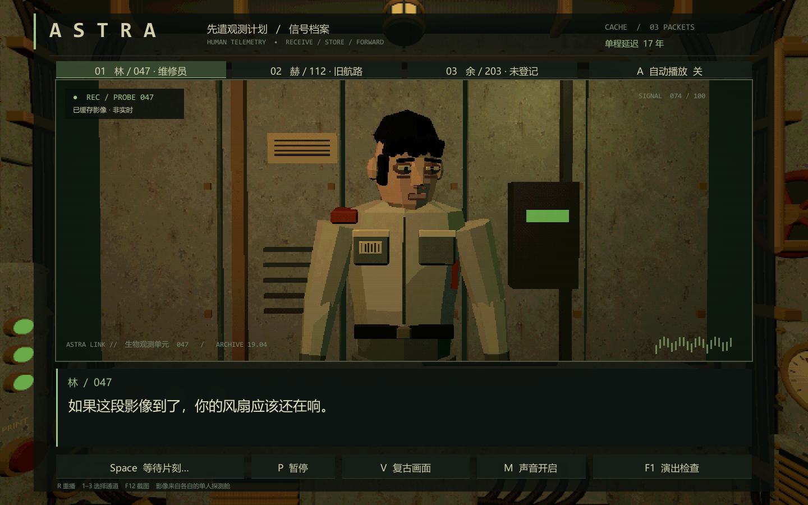
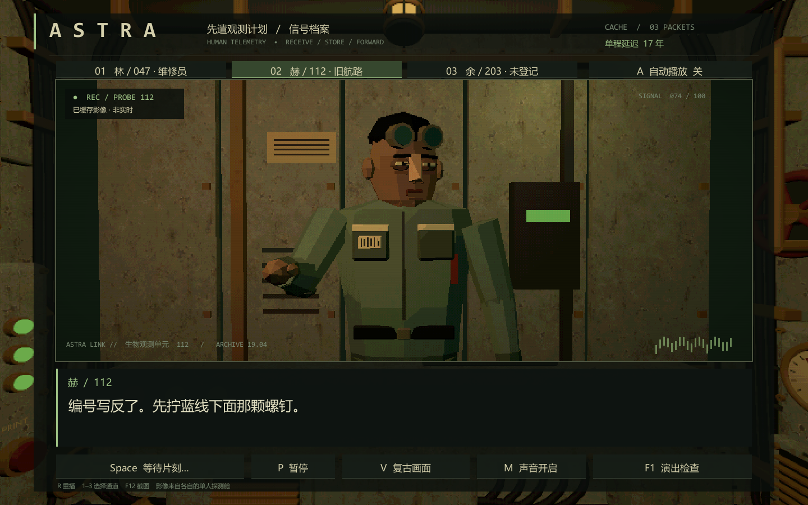
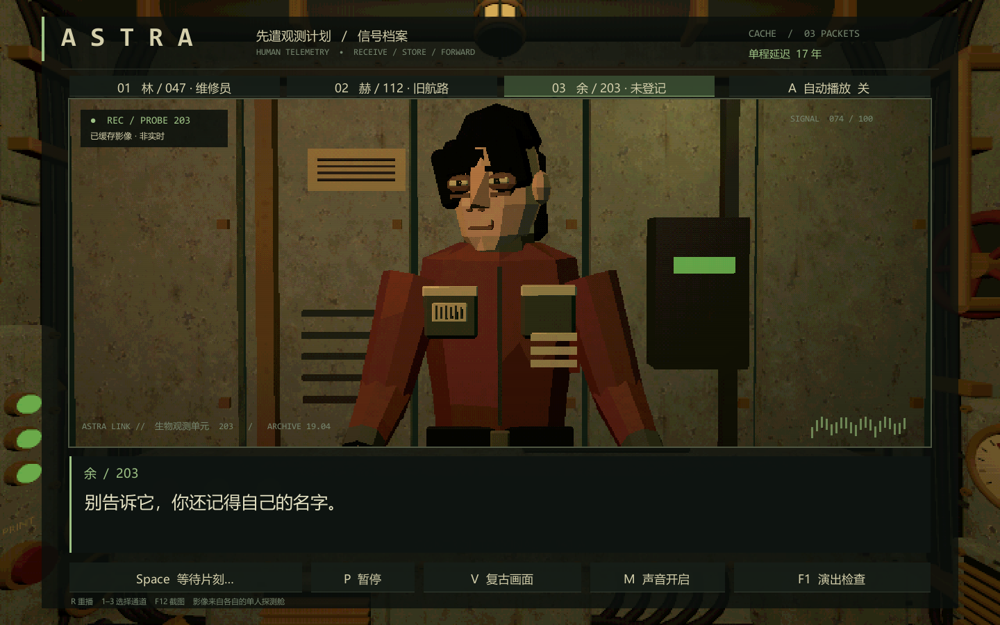
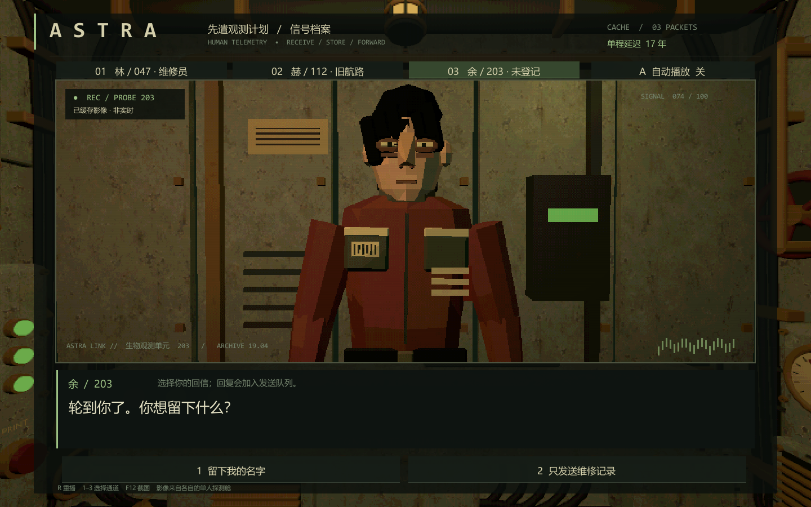
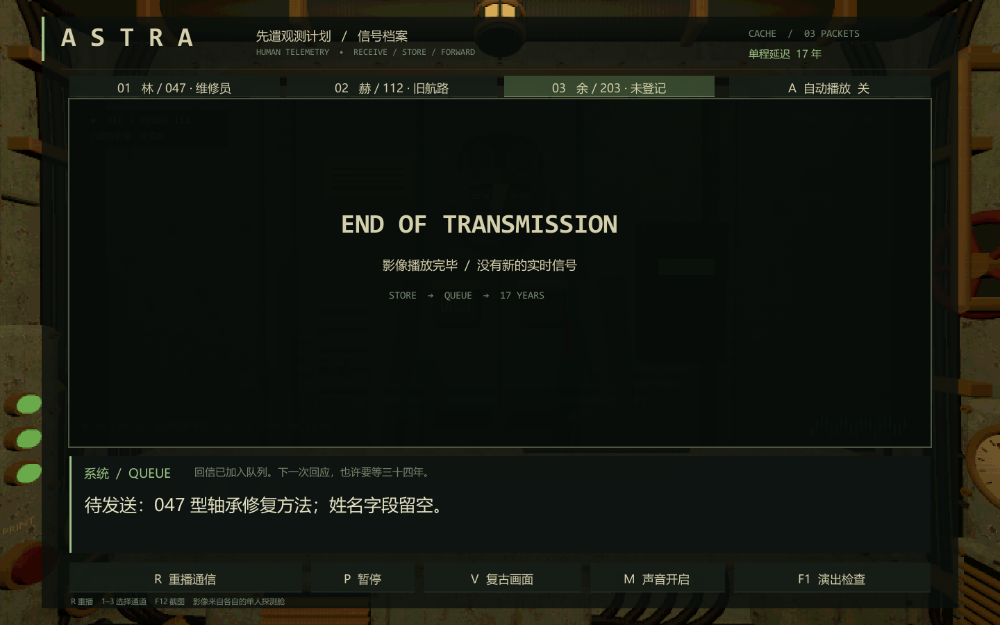
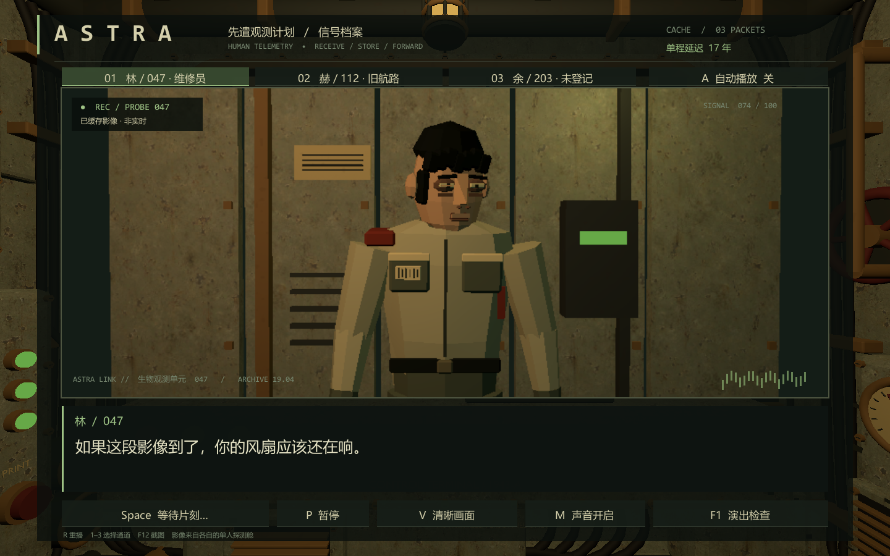

# Demo 操作、复现与验收

## 1. 开始体验

在根目录双击 `Launch.cmd`，或运行 `Build/ASTRA Performance.exe`。整个 Build 文件夹需要保留，不能只拷贝 EXE。

建议先按默认通道逐句阅读，再打开自动播放，最后按 F1 查看演出状态。体验的核心不是操作复杂度，而是同一人在不同句子里的注视、收手和静默，以及回信需要漫长时间才能抵达的落差。

| 操作 | 行为 |
|---|---|
| Space / Enter / 继续按钮 | 未显示完时补全文字；显示完且停顿结束后前进 |
| A | 自动/手动阅读切换；自动模式不替玩家选择 |
| 1 / 2 / 3 | 普通状态切换通信通道；选择时 1 / 2 选择回复 |
| P / Esc | 暂停/恢复；应用失焦也会暂停 |
| R | 重播当前通道，清除之前尚未保存的回信 |
| V | 复古 / 清晰画面比较 |
| M | 静音 / 恢复 |
| F1 | 检查面板：节拍、状态、姿态、视线、手势、时间 |
| 检查面板「查看全身」 | 查看下肢稳定性和手势轮廓 |
| 检查面板「减弱动态」 | 停用环境微动作并取消叙事推近；明确手势仍然保留 |
| 检查面板「中断会话」 | 清理对白与人物表演，R 可重播 |
| F12 | 保存当前帧到本应用 LocalLow 下 Screenshots |
| Alt+F4 / 窗口关闭 | 退出程序 |

该程序没有实时联网或发送消息。两条「回信」分支只是本地内存中的剧情演示，不会联系任何人，也不会改写正式 Astra 存档。

## 2. 编辑内容

打开 UnityProject，进入 `Assets/Performance/Scenes/Performance.unity`，按 Play。选择 `Assets/Performance/Data/SignalArchive.asset`，可直接编辑：对白、角色、姿态、视线、手势、入句/留白、镜头、灯光、后继节点和选项。请保持 ID 唯一，next 必须指向已存在 ID，空 next 代表结束。

菜单 `Astra Performance/Rebuild scene` 重建场景，保留既有 SignalArchive 数据。`Build Windows + verify` 同时运行核心检查并构建。首次生成的数据来自 PerformanceBuild.MakeSequence；修改那段默认数据不会自动覆盖已经存在的作者资产。

人物源文件：`Source/Astra_Performers.blend`；单人 FBX：`Assets/Performance/Models/Lin047.fbx`、He112、Yu203。Blender 文件中的三人横向排列便于编辑，单独导出 FBX 保持人物脚底原点。角色绑定为 13 骨骼刚性蒙皮，系统动作不存为 Blender 动画 clip。

## 3. 命令行复现

默认路径匹配本机安装：Unity `F:/Unity/Installs/2022.3.62f1/Editor/Unity.exe`，Blender `F:/Blender/blender.exe`。迁移到另一台电脑可通过参数覆盖。

```powershell
# 只重新生成场景、验证并构建
powershell -ExecutionPolicy Bypass -File .\Rebuild.ps1

# 先重新生成原创人物，再构建
powershell -ExecutionPolicy Bypass -File .\Rebuild.ps1 -RegenerateCharacters

# 启动可见玩家，自动覆盖关键节点、截图并退出
powershell -ExecutionPolicy Bypass -File .\Verify.ps1

# 本地素材预处理样本，输出目录必须不存在同名转换结果
& 'F:\Blender\blender.exe' -b --python .\Tools\batch_prepare.py -- --manifest .\Source\asset_manifest.example.json --output .\PreparedAssets

# 将最新 Markdown 文档重新生成为离线 HTML
python .\Tools\build_handbook.py
```

Unity CLI 已安装，但其安装枚举未列出已有 Editor，因此本项目使用已核实的 Editor 原生命令行 `-batchmode -executeMethod`。这仍是可复现的 Unity CLI 构建流程。沙箱内的首次启动无法读取本机许可证，随后在授权的正常用户环境构建；没有更改 Unity 许可证配置。

图形验收需要可见窗口。隐藏/最小化玩家可能跳过图形呈现而产生黑帧，不能将这种截图作为通过证据。Verify 默认打开演示窗口，完成后自动退出；不会关闭其他应用。

## 4. 验收的含义

核心检查覆盖：唯一 ID/后继引用、有效速度、逐字时序、跳读不重复动作/音效、最低停顿、暂停、两种回信、重复提交、取消/重播、Unicode 文本单元、不同更新频率、较大 dt、完整默认剧情与 Unity 脚本资源绑定。

运行时检查覆盖：独立 Player 载入、实际骨骼绑定、RT 创建、暂停冻结、声音暂停、选择与结束、滤镜切换、中断清理、受支持 Shader、异常与实机截图。自动调用的是与 UI 共用的会话方法，不等同于逐个物理键盘/鼠标点击的人工测试。

图像检查与最终结果记录在下方和 `QA` 目录。此处没有将 60 FPS 或某类低端 GPU 性能标为已验证，也没有宣称三款角色已达商业美术成品质量。

### 本次实际结果

| 验证 | 结果 | 证据 |
|---|---|---|
| Unity Windows x64 构建 | 成功 | `QA/build-summary.txt` |
| 核心状态/时序/资源绑定检查 | 28 项通过 | `QA/core-verification.txt` |
| 独立玩家运行、渲染与流程检查 | 23 项通过 | `QA/runtime/runtime-verification.txt` |
| 关键画面 | 10 张引擎实机截图；已检查人物正面、三人差异、字幕、选择与结束 | `QA/runtime/*.png` |
| Blender 人物导出 | 2682 / 2482 / 2630 三角面，均为 13 骨骼 | `Source/character_manifest.json` |
| 素材批处理样本 | 成功保留骨架，跳过受保护人物的自动减面并导出审计 | `QA/AssetPreparation/batch_report.json` |

验证设备：Windows 11、NVIDIA GeForce RTX 4070 Laptop GPU，1440×900；Unity 2022.3.62f1。自动化共 51 个断言通过，艺术表现另经截图检查。没有把这种单机结果推广为最低配置保证。

首次 Player 验证暴露的序列化脚本绑定、未激活演员初始化已修正；可见画面检查暴露的 FBX 朝向、网格法线与眼皮局部轴已修正。最后两张对照在同一姿态/机位冻结时钟，只切换画风，避免用不同动作混淆渲染差异。














## 5. 目前明确保留的边界

- 三位角色为约 2.5k 面的原创系统样板；脸、手、衣褶仍需正式美术精修。
- 口型表示文字节奏，不是语音音素识别；没有真人配音。
- 动作使用骨骼层级和程序化包络，没有完整 mocap 动作库与道具接触 IK。
- 开放素材推荐已核查官方资料；第三方角色包没有下载并完成全部风格改造，因此不把「批量库可用」说成「所有资产已经入库」。
- 回信只保留本次运行期间，不构成正式保存/读档系统。
- 独立工程验证不覆盖源 Astra 的全部战斗、导航和窗外演出功能。
