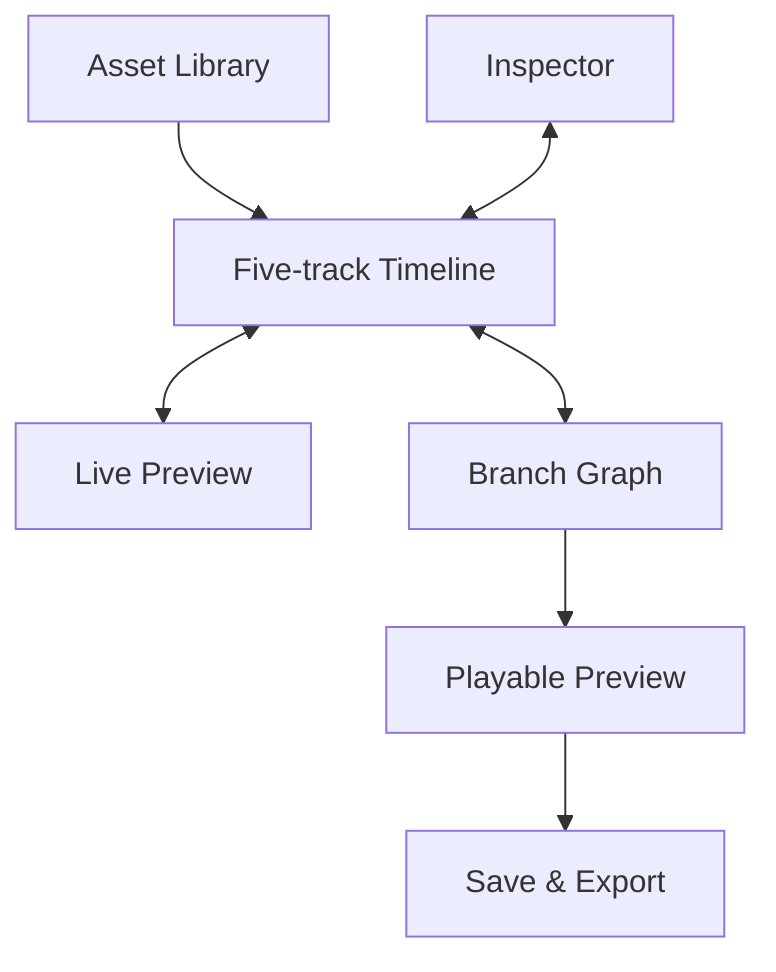
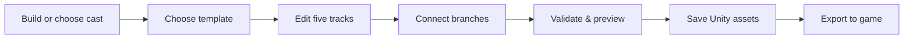
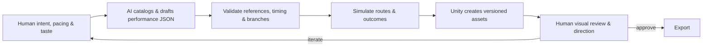

<p align="right">
  <a href="README.md">中文</a> · <strong>English</strong>
</p>

# ASTRA Performance Tool V2

### Edit in-game performances like a video timeline

<p align="center">
  
</p>

**ASTRA Performance Tool V2** is a Unity authoring system for game designers, narrative designers, and small development teams. It turns characters, animation, dialogue, cameras, and scenes into draggable, trimmable, previewable timeline clips, then connects choices, conditions, and endings in a performance graph—bringing game performance authoring closer to the familiar workflow of a non-linear video editor.

> Move from scripting every beat by hand to selecting assets, arranging time, previewing results, and shipping a performance.

> **Main repository focus:** active development and documentation live in [`Tool/V2`](Tool/V2). Earlier demos and Tool/V1 remain in the repository to document the evolution of the prototypes.

[What it does](#what-this-project-does) · [Video-editor workflow](#edit-performances-like-a-video) · [Human × AI](#human--ai-co-creation) · [Under the hood](#under-the-hood) · [Quick start](#quick-start)

---

## What this project does

ASTRA is more than a character creator or animation viewer. It covers the practical pipeline from preparing a cast, through interactive staging, to game-ready export:

- **Build a cast:** combine faces, hairstyles, crests, body types, clothing, accessories, and colors for human, female, and upright-alien characters, then save production-ready Unity assets and Prefabs.
- **Arrange time:** drag cast, action, dialogue, camera, and scene clips onto a five-track timeline, retime or trim them, and inspect the result in a live preview.
- **Design interaction:** connect performance units, conditions, global choices, silence timeouts, and endings in a branching graph.
- **Start from templates:** generate a single call, two-person conversation, interactive question, broadcast, or blank performance, then edit it freely.
- **Validate and deliver:** check references, coverage, graph exits, and ending paths; save a complete Unity asset set or export all dependencies into a game project.
- **Bring in AI:** use a stable JSON Schema and local CLI so GPT / Codex can inspect real assets, draft or revise performances, validate branches, and simulate outcomes before a human gives final creative approval.

## Edit performances like a video

The timeline is ASTRA's primary workspace: asset library on the left, live preview in the center, inspector on the right, and tracks below. Designers drag assets in, move clips to retime events, trim clip edges to change duration, and scrub to any moment. Long sequences can be zoomed and navigated; adjacent animations blend briefly, while manual sampling keeps scrubbing deterministic.



| Track | What it controls | Typical use |
| --- | --- | --- |
| Cast | Characters, presence spans, actor IDs | One, two, or multiple performers |
| Action | Humanoid clips, timing, actor binding | Idle, speech, sitting, repair, dance, and more |
| Dialogue | Text, speaker, choices, patience | Subtitles, questions, silence exits |
| Camera | Shot size, primary actor, companion, effects | Medium, close-up, two-shot, over-shoulder, low angle |
| Scene | Background and coverage span | Rooms, terminals, archive bays, and other stages |

A video timeline usually ends in one fixed result; a game performance must react to the player. ASTRA therefore pairs its timeline with a **branch graph**. A timeline unit can lead to another unit, a condition, a global choice, or an explicit ending. The timeline describes *how a beat plays*; the graph decides *which beat plays next*.

## From character to playable scene

<table>
  <tr>
    <td width="50%"></td>
    <td width="50%"></td>
  </tr>
  <tr>
    <td align="center"><sub>Category selection, full-set application, palette suggestions, and motion checks</sub></td>
    <td align="center"><sub>Distinct alien heads, crests, and live portrait framing</sub></td>
  </tr>
</table>

The project includes both a standalone character workbench and a Unity editor for production assets. The standalone build is ideal for quick visual exploration and appearance JSON; the Unity editor saves approved characters as `ScriptableObject + Prefab`, registers them in the asset library, and makes them immediately available to the performance timeline.

Current content:

- **42 editable presets:** 16 male, 10 female, and 16 alien.
- **10 human faces + 10 distinct alien anatomies.**
- **33 male head options, 14 female head options, and 12 alien crests.**
- **Modular outfits:** 22 top, bottom, and footwear options for male humans and upright aliens; 10 source-pack outfits for the female base. Sets can be applied together or freely mixed.
- **42 real animation clips**, with 17 high-frequency semantic actions shown in the default library.
- **9 preset shots plus custom shots, and 3 scenes.**

<p align="center">
  
  <br><sub>Female hair, headwear, and skin-tone presets</sub>
</p>

<p align="center">
  
  <br><sub>Combination review across ten anatomies and twelve crest options</sub>
</p>

<p align="center">
  
  <br><sub>Tops, bottoms, and footwear can be mixed independently</sub>
</p>

## Templates are a first cut, not a cage

New performances can start from four production-ready structures or a blank project. Templates prefill cast references, animation, cameras, backgrounds, dialogue timing, and graph connections. The result remains ordinary editable performance data—every clip and node is still yours to change.

| Template | Generated first cut |
| --- | --- |
| Single Call | Opening, sign-off, speech motion, medium shot, and ending |
| Conversation | Two-person blocking, alternating dialogue, two-shots and over-shoulder shots |
| Interactive Question | Prompt, two choices, silence timeout, three responses and outcomes |
| Broadcast | Single-speaker announcement, camera, motion, and automatic ending |
| Blank | Empty unit, graph entry, and ending |

<table>
  <tr>
    <td width="50%"></td>
    <td width="50%"></td>
  </tr>
  <tr>
    <td colspan="2" align="center"><sub>One template prepares two-person blocking and shot–reverse-shot coverage</sub></td>
  </tr>
</table>

<table>
  <tr>
    <td width="33%"></td>
    <td width="33%"></td>
    <td width="33%"></td>
  </tr>
  <tr>
    <td colspan="3" align="center"><sub>Interactive questions connect explicit choices, silence timeouts, responses, and outcomes</sub></td>
  </tr>
</table>

## One continuous production path



- **Draft:** automatically cached under `Tool/V2/UnityProject/Library` about every three seconds and restored after script reloads or window reopen.
- **Save:** creates Package, Graph, and Unit assets together, with no need to create them one by one in the Project window.
- **Version copy:** duplicates an existing performance into an independent version while continuing to reuse shared cast and catalog assets.
- **Export:** gathers the performance and its dependencies into an `Assets` folder that can be merged into the target Unity game project.

## Human × AI co-creation

ASTRA also explores a practical model of human–AI collaboration: **the AI does not bypass the tool and fabricate Unity assets. It works through the same catalog, templates, validation rules, and versioned workflow used by human creators.**



The local CLI exposes `doctor`, `catalog`, `template`, `inspect`, `validate`, `simulate`, `apply`, and `export`. An AI can query real characters, motions, scenes, shots, and effects before drafting versioned JSON, then reuse Unity's own templates and logic for validation and deterministic branch simulation. It does not overwrite existing performances or silently alter a designer's active draft.

The division of responsibilities is explicit:

- **Humans own:** creative intent, acting, camera language, pacing, emotion, and final visual judgment.
- **AI assists with:** catalog search, first drafts, bulk revision, consistency checks, branch coverage, and repetitive version work.
- **The tool enforces:** real asset references, data structure, reachability, time coverage, non-destructive writes, and traceable outputs.

The goal is not to replace game designers or animators. It is to hand repetitive catalog lookup, scaffolding, validation, and data entry to machines, leaving creators more time to answer the question that matters: *why does this scene work?*

## Under the hood

```text
Blender modular source
        ↓
ModularCast.fbx + shared 51-bone Humanoid rig
        ↓
Unity character assets / prefabs / motion catalog
        ↓
Five-track ToolUnit ── Branching ToolGraph ── ToolPackage
        ↓
Manual Playables sampling + live preview + ToolPlayer runtime
        ↓
Versioned assets / dependency export / game integration
```

### Characters and assets

- Modules are modeled and skinned in Blender, then exported onto a shared 51-bone Humanoid rig. Runtime code switches meshes, BlendShapes, and material properties rather than generating temporary character geometry.
- Human face deformation propagates to hair, face accessories, and related parts. Aliens use ten genuinely distinct head anatomies instead of scaling one grey-alien head.
- Production characters combine `ToolCharacter`, an appearance recipe, and a Prefab. `MaterialPropertyBlock` avoids duplicating whole materials for color changes.

### Motion and preview

- `ToolMotion` uses a manually updated Unity `PlayableGraph` with a two-input `AnimationMixer`.
- Timeline sampling sets clip time directly and calls `Evaluate(0)`, so scrubbing is deterministic and does not replay the sequence from the beginning.
- Adjacent actions blend over roughly 0.22 seconds. Root motion is disabled; scene-level blocking controls placement.
- The character editor, timeline preview, and runtime player share the same character construction, animation sampling, blocking, and camera logic.

### Data, branching, and delivery

- `ToolUnit` stores the five tracks. `ToolGraph` stores Unit, Condition, GlobalChoice, and End nodes. `ToolPackage` combines performances with their catalog.
- Validation covers asset references, actor binding, clip boundaries, exit targets, unreachable nodes, and ending paths. Logic simulation reuses the real `ToolLogic` implementation.
- Production data uses Unity `ScriptableObject` assets. AI interchange uses a versioned JSON Schema, avoiding direct Unity YAML editing or fabricated GUIDs.
- The CLI prefers a running Unity Editor but can launch a batch process. Its local file bridge opens no network port.

See [Technical architecture](Tool/V2/Docs/技术架构.md), [Character and performance design](Tool/V2/Docs/捏人与演出设计.md), and [CLI research and implementation](Tool/V2/Docs/演出CLI与代码调研.md) for more detail.

## Quick start

### 1. Try the character workbench

On Windows, launch `Tool/V2/RunToolV2.cmd`, or run `Tool/V2/Build/ASTRA Performance Tool V2.exe` directly.

Choose New Human or New Alien, edit the character on the left, then rotate it, switch between portrait and full-body framing, and try motions on the right. The standalone build saves appearance JSON for rapid exploration; save production performance characters inside the Unity editor.

### 2. Author a performance in Unity

1. Run `Tool/V2/OpenUnityV2.cmd`, or open `Tool/V2/UnityProject` with **Unity 2022.3.62f1**.
2. Choose `Astra Performance Tool V2 → Open timeline`.
3. Select New Performance, then choose a template and cast, or start from a blank performance.
4. Drag cast, actions, dialogue, cameras, and scenes to their tracks; scrub the playhead to inspect the live preview.
5. Open the performance graph and connect choices, conditions, and endings.
6. Select Validate and Run Preview, then Save or Export to Game.

See the [User manual](Tool/V2/Docs/使用说明书.md), [Performance templates](Tool/V2/Docs/演出模板使用说明.md), and [Drafting and export](Tool/V2/Docs/演出草稿与一键导出.md) for the complete workflow.

### 3. Add an AI / CLI workflow

The CLI requires Python 3.9+ and only uses the standard library:

```powershell
cd .\Tool\V2
python .\CLI\astra.py doctor
python .\CLI\astra.py catalog --out .\catalog.json
python .\CLI\astra.py template --kind Question --name "Outpost Help" --speaker "Assets/AstraToolV2/Characters/Original_Echo.asset" --params .\CLI\examples\question.params.json --out .\outpost.performance.json
python .\CLI\astra.py validate --input .\outpost.performance.json
python .\CLI\astra.py simulate --input .\outpost.performance.json --route accept
```

Before asking GPT / Codex to modify a performance, have it read the [CLI agent guide](Tool/V2/CLI/agent-guide.md) and [JSON Schema](Tool/V2/CLI/performance.schema.json). The CLI does not create new models, animation, or voice-over, and does not automatically modify the game star map, task rewards, or builds.

## Reproducible build

Git clones do not include `Tool/V2/Build` or `Tool/V2/Export`. From the repository root, run:

```powershell
cd .\Tool\V2
.\Rebuild.ps1
```

Use `.\Rebuild.ps1 -Models` to regenerate modular models from the Blender source. `-EditorPath` and `-BlenderPath` can override local tool locations.

## Repository map

| Path | Purpose |
| --- | --- |
| `Tool/V2/UnityProject/Assets/AstraToolV2` | Runtime, editor, characters, motion, samples, scenes, and performance assets |
| `Tool/V2/CLI` | Python CLI, JSON Schema, and examples for automation and AI |
| `Tool/V2/Source` | Blender sources, original assets, manifests, and provenance |
| `Tool/V2/Tools` | Modular-model and asset rebuild scripts |
| `Tool/V2/Build` | Standalone Windows character workbench |
| `Tool/V2/Export` | Deliverables for import into other Unity projects |
| `Tool/V2/QA` | Structural checks, runtime logs, screenshots, and visual regression material |
| `Tool/V2/Docs` | User guides, design decisions, architecture, and acceptance records |

## Current boundaries

- This is a low-poly modular character and performance system, not a photorealistic scanned-head or arbitrary-topology editor.
- New character creation currently targets humans and upright aliens. Orcs remain available as finished cast members; quadrupeds require manual authoring with suitable motions.
- Walk and run animations play in place by default. Exact blocking, prop contact, IK, lip sync, voice-over, and gaze require the host game or future tracks.
- Branch simulation validates data and logic, not visual quality. Camera composition, intersections, pacing, and emotion still require human review in Unity's Run Preview.
- Export gathers performance dependencies, but does not bind star-map events, modify task state, or build the game automatically.

## Why this project exists

In game development, even “a simple conversation” crosses character art, animation, cameras, writing, conditions, asset management, and engineering delivery. When every revision requires manual references, cross-discipline handoffs, and repeated checks, coordination quickly costs more than the scene itself.

ASTRA explores a different workflow: bring those steps into one visual, verifiable, automatable authoring system. Designers edit performances with the directness of video; engineers define reliable runtime and delivery boundaries; AI handles repetitive work inside a real schema, real asset catalog, and non-destructive version process. The goal is not automation for its own sake, but **more creative iterations, lower coordination cost, and a more accessible path from an idea to a playable scene**.

## Documentation and attribution

- [User manual](Tool/V2/Docs/使用说明书.md)
- [Technical architecture](Tool/V2/Docs/技术架构.md)
- [Asset extension guide](Tool/V2/Docs/资产扩充与目录指南.md)
- [Drafting and export](Tool/V2/Docs/演出草稿与一键导出.md)
- [In-game meeting integration](Tool/V2/Docs/终端会议接入.md)
- [QA record](Tool/V2/Docs/验收记录.md)
- [Third-party notices](Tool/V2/THIRD_PARTY_NOTICES.md)

See `Tool/V2/THIRD_PARTY_NOTICES.md` for the authoritative list of third-party assets, licenses, and modifications.

## Earlier demos and tools

`Tool/V2` is the active focus. Three standalone demo generations and the first authoring-tool prototype remain available as a record of how the character, motion, camera, and creature workflows evolved.

| Version | Scope | Entry |
| --- | --- | --- |
| Demo V1 | Three human characters, early staged performances, and a delayed-communication interface | [Documentation](Demo/V1/README.md) · [Launch](Demo/V1/Launch.cmd) |
| Demo V2 | Quaternius cast, Humanoid motion, four-character scenes, and nine camera shots | [Documentation](Demo/V2/README.md) · [Launch](Demo/V2/Launch.cmd) |
| Demo V3 | Six-character scenes, upright aliens, orcs, and quadruped aliens | [Documentation](Demo/V3/README.md) · [Launch](Demo/V3/Launch.cmd) |
| Tool V1 | First character-creation and performance-authoring tool using the V3 visual style | [Documentation](Tool/V1/README.md) · [Launch](Tool/V1/Launch.cmd) |

See [Git tracking notes](Git追踪说明.md) for repository scope, Unity caches, and local build-artifact rules.
