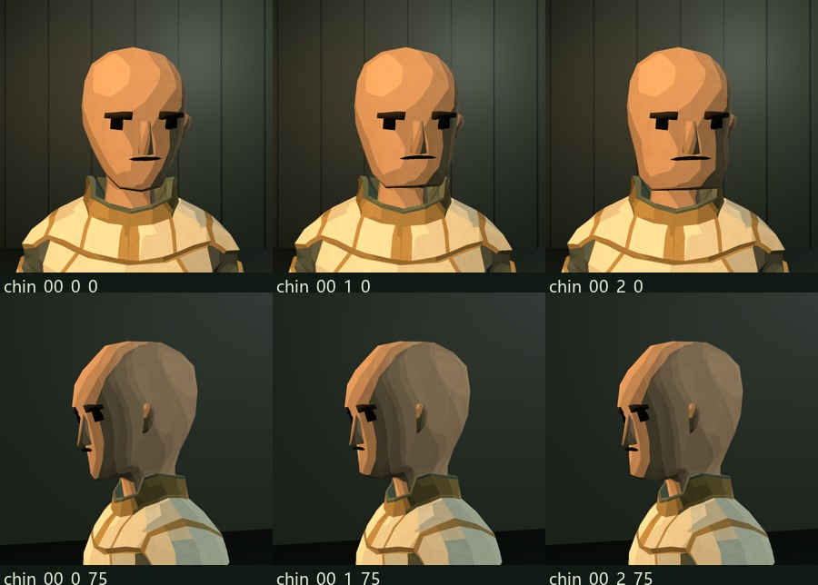
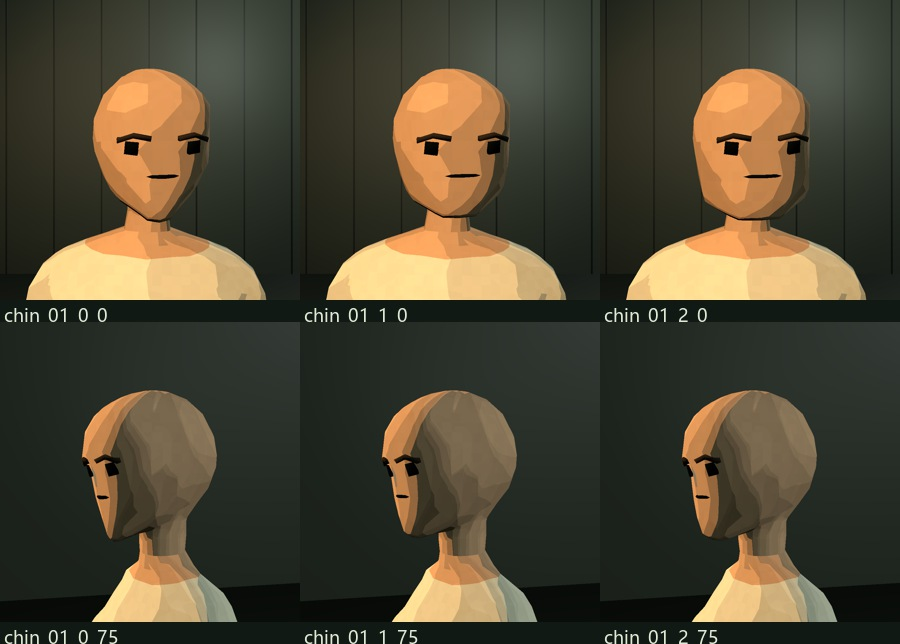
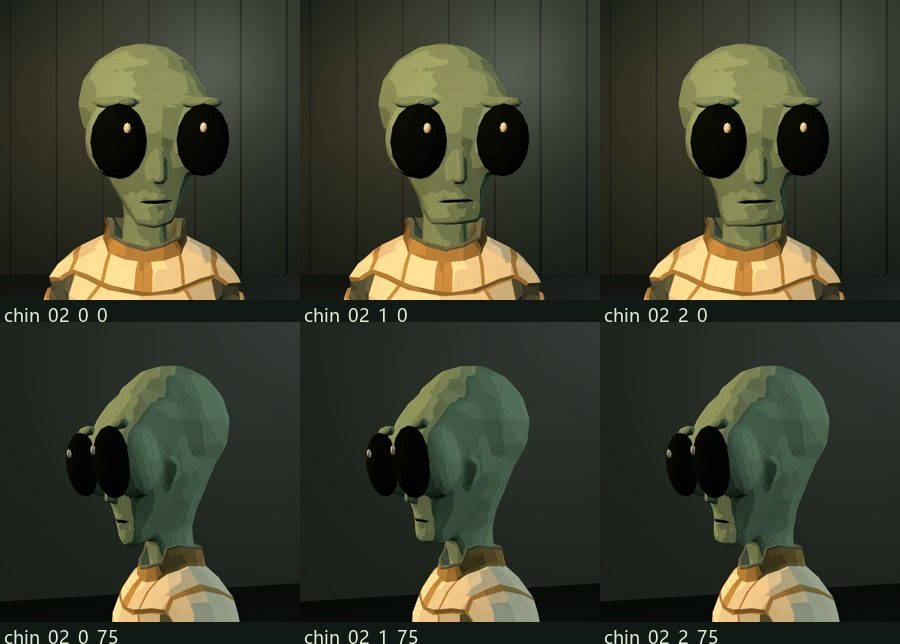
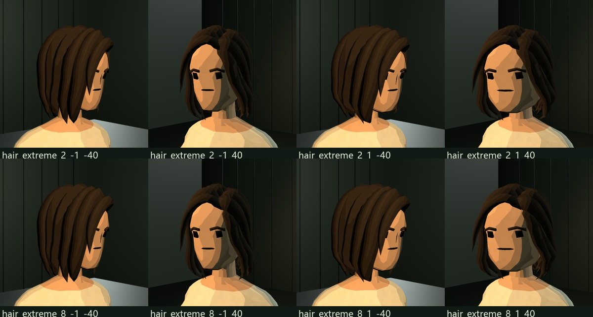

# 下巴、几何嘴部与女性发际线

适用：Tool/V2，2026-09-27。旧角色编号、200 个模块、51 根共用骨骼和 UAL 动作接口保持兼容。

## 使用入口

**面容 → 下巴 → 原型 / 圆下巴 / 方下巴**。男性、女性和全部 10 种外星人头型均有此选项。下巴独立于脸型，可先选脸型或外星人生物头型，再选择下巴。方下巴主要加宽颏部与下颌角，保留圆角和脸颊过渡，并非正方形。

`chinStyle` 保存到外观 JSON 和正式角色资产；Prefab 实例化后按角色数据恢复。旧存档缺少此字段时使用 0，即原型。

## 嘴部方案

- 男性保留原有小型几何嘴型及六种口部参数。
- 女性使用同类几何口缝，依据底模皮肤表面贴合；原鼻部保留，重叠边缘埋回脸部，清理口部下面的贴面碎片。
- 灰裔与有口缝的特殊外星人把口缝直接切进皮肤网格。深色口缝、浅凹槽与周围皮肤共享边和顶点，脸宽、下巴与口型变形共同作用于这张网格。阔吻族的口缝位于实际吻部，鸟喙保留上下喙结构。
- 删除嘴部 UV 贴图与材质采样。**脸颊纹样仍使用 UV2**，它与嘴部是两个独立功能。

## 女性发际线原因与修复

原包长发由完整发束组成，部分发根原本埋在头部内部。之前的适配把所有埋入头皮的顶点向外推，连内侧发根也推到了额头表面，形成方块、尖片与鬓角碎片。

现在保留发束原有结构，只对带连续发际线的贴头底层做间距校正；不再把发束内部顶点投射到额头。披肩侧分、商务披发与其他女性原包发型保留原来的造型。短发底层也针对完整女性头皮重新适配。

## 技术维护位置

| 内容 | 文件 / 约定 |
| --- | --- |
| 下巴连续变形、接入皮肤的几何口缝 | `Tools/face_geometry.py` |
| 主构建与形态键导出 | `Tools/build_modular.py`；`ChinRound` / `ChinSquare` |
| 外星人下颌支撑环与各类口器 | `Tools/alien_design.py` |
| 女性发际线与嘴部装配 | `Tools/import_women.py` |
| 女性鼻部边缘贴合 | `Tools/fit_female_features.py` |
| 补全女性后脑 | `Tools/female_scalp.py` |
| 形态键法线 | `Editor/ToolModularNormals.cs`：根据几何变化旋转原始法线；未变形处保持原有明暗 |
| 参数和菜单 | `Runtime/ToolData.cs`、`ToolCreatorOptions.cs`、`ToolWorkbench.cs` 与 `Editor/ToolV2CharacterCreatorWindow.cs` |
| 运行时形态键应用 | `Runtime/ToolCharacterView.cs` |

下巴变形在颈部和上脸颊处平滑衰减，头发与通用配饰使用相同空间变形。特殊外星人的下颌位置比人类更高，单独适配高度，并增加支撑环，让形变作用于连续面，而非拉扯两个相距很远的截面。

不要重新给嘴部创建固定坐标的独立悬浮零件。新增外星人时应把口缝接入实际皮肤或吻部，并确认下颌支撑环和嘴部形态键跟随关系。

## 对照图与验证

下巴对照图每排依次为原型、圆下巴、方下巴；上下两排为正面与侧面。

验证报告和全部联系表位于 `QA/ChinHair/`。网格检查覆盖下颌三角形在圆／方下巴和滑块极值下的翻面情况；实机截图覆盖 12 种头部、嘴部侧面、女性发际线左右两侧、低头与舞蹈。具体数量和最终结果以该目录内 `visual-review.md`、`editor-checks.txt`、`mesh-verification.json`、`Runtime/result.txt` 为准。
