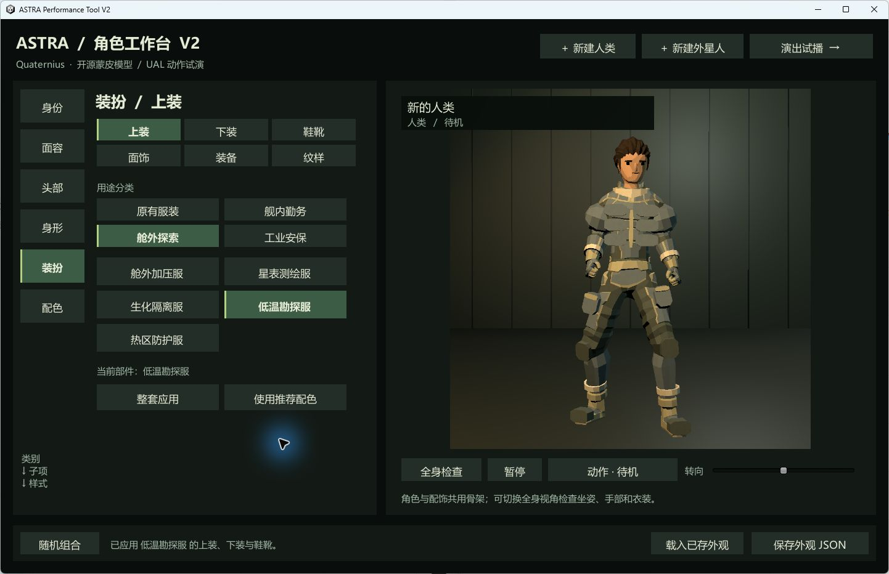

# ASTRA 演出工具 V2 使用说明书

适用：`Tool/V2`，包含外星人重设计、原包长发、22 套男性／外星人服装与 10 套女性服装的当前版本。核对日期：2026-09-27。面向策划与角色设计人员。

**第一次使用建议：先完成第 2 章的捏人练习，再按第 5 章做出一段 8 秒演出。**

## 1. 从哪里打开：先选你的工作目标

工具根目录：

```text
F:\Documents\GitHub\GameDev_Performance_System\Tool\V2
```

| 你要做什么 | 打开什么 | 最后保存什么 |
| --- | --- | --- |
| 快速搭配形象、试服装、看动作 | 双击 `RunToolV2.cmd` | 外观 JSON |
| 创建能放进演出里的正式角色 | 双击 `OpenUnityV2.cmd` → 新建角色 | 角色资产与 Prefab |
| 编排人物、动作、台词和镜头 | Unity → `Astra Performance Tool V2 → Open timeline` | 演出单元 |
| 做选择、条件和剧情分支 | Unity → `Astra Performance Tool V2 → Open graph` | 演出树与演出包 |

**独立程序保存的 JSON 暂时没有直接导入 Unity 捏人编辑器的按钮。** 如果形象要用于正式演出，建议直接从 Unity 新建角色。独立程序适合先试搭配；可以记录选项名称及截图，之后在 Unity 中复现。

Unity 工程位于根目录的 `UnityProject`，对应版本为 **2022.3.62f1**。用 Unity Hub 打开时，选择这个文件夹，不要选择 `Tool/V2` 或 `Build`。首次导入完成、界面不再编译后，再打开工具菜单。

## 2. 五分钟捏出一个角色

### 2.1 新建与选择预设

1. 双击 `RunToolV2.cmd`。
2. 顶部点击 **＋ 新建人类 ▾ → 男性／女性**，或 **＋ 新建外星人**。
3. 左侧进入 **身份 → 基本资料**，填写角色名字。也可以进入 **身份 → 预设角色**，选择现成形象作为起点。
4. 按“面容 → 头部 → 身形 → 装扮 → 配色”的顺序调整，最后检查动作。

在 **身份 → 基本资料 → 人类底模** 中也可切换男性／女性；切换会重置头发和衣服为对应底模默认款，脸型与配色仍可继续调整。**身份 → 预设角色** 只列出当前底模的预设。

当前支持新建人类和站立外星人。原有半兽人仍可以作为成品角色用于演出；这里没有新建半兽人或四肢爬行角色的菜单。

### 2.2 每一层菜单负责什么

| 一级菜单 | 子级内容 | 推荐操作 |
| --- | --- | --- |
| 身份 | 基本资料、预设角色 | 先起名或选预设，再细调 |
| 面容 | 脸型／生物头型、眼睛、眉骨、鼻部／嗅觉器官、口部／口器 | 先选大轮廓，再调五官和宽度 |
| 头部：人类 | 短发、分缝刘海、长发束发、帽饰 | 先选类别，再选具体样式 |
| 头部：外星人 | 鳍膜叶瓣、角环骨板、触须感官 | 配合头型检查正面、侧面和背面 |
| 身形 | 体型、整体比例 | 先选 8 种体型之一，再调身高比例 |
| 装扮 | 上装、下装、鞋靴、面饰、装备、纹样 | 先定服装，再加配件 |
| 配色 | 肤色、发色／颅冠基色、服装色、眼色、强调色 | 服装色负责主色，强调色负责识别部件 |

人类有 10 种脸型；男性有 33 个、女性有 14 个发型／头饰选项；外星人有 10 种解剖头型、12 个颅冠选项。数量包含“无发／无冠”以及人类帽饰。身高范围为基础模型的 0.90–1.10 倍。

**摘帽：进入“头部 → 帽饰 → 无”。** 会恢复戴帽前的发型，切换不同帽子也会保留这个记录；如果本来是无发，摘帽后仍是无发。发型和帽饰仍采用互斥显示，以避免长发穿过帽体。

**面部纹样已改为皮肤贴图。** 在“装扮 → 纹样”选择无、左颊、右颊、双颊等款式，在“配色 → 强调色”调整颜色。纹样不会增加脸部厚度，也不会改变轮廓；既有角色和 JSON 的纹样编号继续有效。“装扮 → 面饰”中的额灯、眼镜、呼吸器、面罩属于实体配件，想去掉它们请选择面饰“无”。

部分外星人头型没有人类式眉骨，或不适配人类眼镜等面饰，对应选项会隐藏或显示说明。九种特殊头型目前支持“无面饰／护颈”；这属于适配范围，不是选项丢失。

### 2.3 检查形象，避免只看正面

右侧点击 **全身检查** 看衣服和鞋靴，点击 **面部特写** 看五官、头发和颅冠。拖动 **转向** 滑条，依次查看正面、侧面、背面。

打开右侧 **动作·…** 菜单，至少试一次“说话”“坐姿待机”“跪姿维修”。用 **暂停** 停在弯腰或抬手的位置，观察衣领、肩部、腰袋、头发是否相互遮挡。选长外套、大颅冠、厚重装备时尤其要看侧面和背面。



*上图是现有工作台的实际截图。左侧逐层选部件，右侧试动作与转向，底部保存外观。*

### 2.4 保存与下次继续

点击底部 **保存外观 JSON**。当前 Windows 账户的保存目录是：

```text
C:\Users\32881\AppData\LocalLow\Project Astra\ASTRA Performance Tool V2\Characters
```

在资源管理器地址栏也可以输入：

```text
%USERPROFILE%\AppData\LocalLow\Project Astra\ASTRA Performance Tool V2\Characters
```

文件名类似 `custom_abc123.json`，文件中记录名字、种族和外观选项。**载入已存外观目前只载入这个目录中最近修改的一个 JSON**，没有角色列表或文件选择器。需要保留多个方案时，可以把 JSON 分别备份到按角色命名的文件夹；程序界面尚不支持点选任意历史方案。

继续保存同一草稿会更新它的文件；载入外观后会生成新的草稿 ID，再保存可能产生新文件。不要仅凭文件数量判断是否保存成功，可结合文件修改时间与 JSON 内的名字确认。

**新建角色、载入预设、随机组合都会替换当前草稿；关闭前请主动保存。** “随机组合”会改变多项外观，不是只随机当前子菜单。

顶部 **演出试播** 播放演出包里已经配置的角色和剧情，不会把当前捏人草稿自动替换进去。按 `Esc` 或点击“返回捏人”回到工作台。

## 3. 太空服装怎么搭配

进入 **装扮 → 上装／下装／鞋靴 → 用途分类 → 具体款式**。上下装和鞋靴可以分别选择，男性／外星人的三个部件各有 22 款，女性各有 10 款。两种底模使用各自适配的服装列表，避免身体与头部错配。

| 用途分类 | 可选服装 |
| --- | --- |
| 原有服装 | 航行服、工程服、维修服、休闲服、夹克、正装、安保服、探索服、拼接服、长外套 |
| 舰内勤务 | 轨道驾驶服、轨道医疗服、舰桥礼勤服、远航行商服 |
| 舱外探索 | 舱外加压服、星表测绘服、生化隔离服、低温勘探服、热区防护服 |
| 工业安保 | 采矿动力服、废船拆解服、舰队安保服 |

**最快换一整套的步骤：**

1. 进入 **装扮 → 上装 → 舱外探索**。
2. 选择 **低温勘探服**。
3. 点击 **整套应用**，让上装、下装、鞋靴一起使用低温勘探款。
4. 点击 **使用推荐配色**，套用该款的服装主色与强调色。
5. 切到 **装备** 添加需要的配件，再用全身检查转向并试动作。

“整套应用”以**当前正在编辑的部件所选款式**为准；也可以从下装或鞋靴应用整套。它不会重置脸型、发型或装备。“使用推荐配色”只改服装色和强调色，不会改肤色。只切换用途分类，不会自动换衣服。

想混搭时，先整套应用，再单独换上装、下装或鞋靴。例如用轨道驾驶上装、星表测绘下装与舱外加压靴构成探索员；混搭后需要重新检查腰部和裤脚接缝。

按形象用途选起点：舰桥人员用驾驶／礼勤，工业人员用采矿／拆解，医疗隔离用医疗／生化，外勤用加压／测绘／低温／热区，安保用舰队安保，商旅角色用行商。服装是美术资产，不会自动附带防护数值或职业能力。

查看实际模型：[人类 12 套新服装总览](../QA/OutfitSheets/Human_000.jpg) · [外星人 12 套新服装总览](../QA/OutfitSheets/StandingAlien_000.jpg) · [混搭检查](../QA/OutfitSheets/mixed_outfits.jpg)。

## 4. 在 Unity 中保存正式角色

### 4.1 新建正式资产

1. 双击 `OpenUnityV2.cmd`，等 Unity 导入完成。
2. 顶部菜单点击 **Astra Performance Tool V2 → Open timeline**。
3. 左侧素材库切到 **人物**，点击 **＋ 新建角色 → 人类／外星人**。也可以直接用顶部菜单 **Astra Performance Tool V2 → New character → Human／Alien**。
4. 捏人窗口填写 **名字** 与 **唯一 ID**，按第 2、3 章的菜单调整外观。
5. 检查右侧动作、转向和面部特写，点击 **保存角色与 Prefab**。
6. 回到时间轴的人物素材库，展开对应种族的 **自建角色**，找到刚保存的名字；可用搜索框按名字或 ID 查找。

名字可以写中文。唯一 ID 使用英文字母、数字、下划线或短横线，长度为 1–64，且不能与现有角色重复。例如：`engineer_chen_01`。保留工具自动生成的 ID 也可以；角色投入使用后，尽量保持 ID 不变。

保存位置相对于 `UnityProject`：

```text
Assets/AstraToolV2/Characters/<角色 ID>.asset
Assets/AstraToolV2/Characters/Prefabs/<角色 ID>.prefab
```

新角色会同时注册到人物素材库。正式角色的 `.asset` 保存外观配置，`.prefab` 用于实例化人物，两者都应保留。

### 4.2 修改现有角色

在人物素材库点选角色，右侧点击 **打开捏人编辑器**，改完再次点击 **保存角色与 Prefab**。

**这会修改这个角色本身，引用它的演出也会使用更新后的外观。** 想做另一名角色，应从“＋ 新建角色”开始，不要把修改现有角色当成“另存为”。关闭捏人窗口前请主动保存草稿。

素材库分为 **Demo V2 原角色／捏人预设／自建角色**。四个 Demo 原角色保留原模型，不通过这套捏人编辑器改造；需要自由搭配时，新建一个模块化角色。Unity 版配色还支持自定义颜色。

## 5. 照着做：制作一段 8 秒对话

目标：一名工程师在档案舱说两句话，前 4 秒中景，后 4 秒近景。建议先完成这一段，再加多人和分支。

### 5.1 创建演出单元并放进演出树

1. 在 Unity 的 **Project** 资源窗口找到 `Assets/AstraToolV2/Exports`。在文件夹空白处右键，选择 **Create → Astra → Performance Tool V2 → Unit**。
2. 将新文件命名为 `Unit_Manual_Intro`。选中它，在 Unity 的 **Inspector** 中把 **Id** 设为 `manual_intro`，**Duration** 设为 `8`。
3. 打开 **Astra Performance Tool V2 → Open graph**。先记下原来入口节点的 ID，方便练习后恢复。
4. 点击 **＋ 演出单元**，选中新节点，在右侧 **演出单元** 字段拖入刚才创建的 `Unit_Manual_Intro` 资产，然后点击 **设为入口**。
5. 点击 **＋ 结束** 创建结束节点。单击演出单元右侧的 **next** 小端口，再单击结束节点的主体，即完成连接。
6. 回到 **Open timeline**，在顶部单元下拉框选择 `manual_intro`。

“＋ 演出单元”只创建演出树上的节点，**不会自动创建 Unit 资产**，所以第 1、2、4 步都需要做。时间轴顶部下拉框列出演出树已经引用的单元；找不到新单元时，先检查节点是否绑定了资产。

### 5.2 按顺序填写五条轨道

左侧素材库的 **人物／动作／台词／镜头／场景** 分别对应下方同名轨道。先拖入素材，再点选片段，在右侧填写准确时间。普通台词拖入 **纯文本 · 打字机**，选择台词拖入 **选择 · 含沉默**。时间单位都是秒；“时长”是持续多久，不是结束时刻。

| 顺序 | 轨道与素材 | 开始 | 时长或文字设置 | 关键字段 |
| --- | --- | --- | --- | --- |
| 1 | 人物：刚保存的工程师 | 0 | 时长 8 | 轨 ID = `actor0` |
| 2 | 动作：说话 | 0 | 时长 8，倍速 1 | 人物轨 = `actor0`；动作 ID = `Idle_Talking_Loop` |
| 3 | 台词：普通文字 | 0.5 | `中继站已经恢复，准备发送信号。`；字/秒 12，停留 1 | 形式 = `Text`；人物轨 = `actor0` |
| 4 | 台词：普通文字 | 4 | `如果没有回应，我们就前往下一站。`；字/秒 12，停留 1 | 形式 = `Text`；人物轨 = `actor0` |
| 5 | 镜头：中景 | 0 | 时长 4 | 镜头 = `Medium`；主体 = `actor0` |
| 6 | 镜头：近景 | 4 | 时长 4 | 镜头 = `Close`；主体 = `actor0` |
| 7 | 场景：档案舱 | 0 | 时长 8 | 场景 ID = `archive` |

台词时长按“文字长度 ÷ 字/秒 ＋ 停留”自动计算，可在属性底部看 **自动时长**。上述两句互不重叠，均在 8 秒内结束。

拖动片段主体可移动开始时间；拖动右边缘可改一般片段的持续时间。做精确演出时，以右侧数值为准。普通台词用字速和停留控制长度，选择台词用耐心秒数控制长度。

五条轨道上的片段均有黑色边框，即使相邻片段颜色相同也能辨认接缝；选中的片段另有浅金色顶部高亮。拖动边缘时仍以原片段时间位置为准，边框不额外占用演出时间。

**演出单元没有 9 秒上限。** 时间轴上方常驻“单元时长（秒）”，可直接输入 `120`、`600`、`3600` 等；“＋30秒”用于快速延长。将片段拖过末尾、修改开始／时长，或把素材放到末尾之后，单元会自动延长。人物出场仍要覆盖它的动作时间；自动延长单元不会擅自延长人物出场或已有动作。

长演出可用“全览”显示完整单元、用“缩放”看细节，或在“定位秒”直接输入目标时刻。底部可横向滚动。点击“匹配内容”将时长收至最后一个片段的末尾；手动缩短不会截掉现有片段，需要先缩短或删除末尾片段。

### 5.3 分两次检查播放

1. 点击时间轴顶部 **播放**，观察人物、动作、场景和两次镜头构图。点击时间尺可以跳到指定时刻。
2. 点击 **验证**，处理弹窗列出的问题。
3. 完成编辑后用 Unity 的 **File → Save Project** 保存工程资产。
4. 点击工具的 **运行预览**。进入 Unity 的 **Game** 窗口后，点击工作台顶部 **演出试播**，观看文字和剧情流程。
5. 播放时 `Space` 用于暂停／继续；选择项用鼠标点击。回到工作台用 `Esc`，结束 Unity 运行则点击编辑器顶部的 Play 按钮。

时间轴“播放”用于检查画面，不运行完整的台词选择逻辑。完整试播从**演出树入口**开始，不从时间轴当前选择的单元或播放头开始。此练习使用工程默认的 `AstraSample.asset` 演出包；不要在练习中更换顶部演出包字段。

练习结束后，如果要恢复原演出，回到演出树，选中之前记下的入口节点，再点击 **设为入口** 并保存。

## 6. 多人、动作和镜头的常用操作

### 6.1 三种 ID 不要混用

| 名称 | 示例 | 谁引用它 |
| --- | --- | --- |
| 角色唯一 ID | `engineer_chen_01` | 人物素材库中的正式角色资产 |
| 人物轨 ID | `actor0`、`actor1` | 动作的“人物轨”、台词的“人物轨”、镜头的“主体／陪体” |
| 演出树节点 ID | `Unit_4` 等 | 演出树连接和入口 |

同一单元中每个人物片段使用不同的轨 ID。增加第二个人物后，检查新动作、台词和镜头引用了谁；它们可能默认引用第一个人物。改人物轨 ID 后，也要手动更新相关片段里的引用。

动作必须完全落在对应人物的出场时间内。例如动作是 2–6 秒，则人物至少应覆盖这整个区间。先放人物再拖动作；如果动作拖不进去，先检查落点时刻有没有人物。

人物站位由现有演出系统安排，时间轴没有自由拖拽人物站位的界面。先用预设镜头建立构图，再决定是否需要定制站位功能。

### 6.2 怎么选动作

| 演出用途 | 可用动作 |
| --- | --- |
| 站立交谈 | 待机、说话、拍胸、触头 |
| 设备与劳动 | 操作设备、取物、跪姿维修、推压 |
| 坐姿交谈 | 坐下 → 坐姿待机／坐姿说话 → 起身 |
| 移动与特殊情绪 | 行走、正式行走、慢跑、蹲伏、舞动 |

默认菜单提供 17 个演出动作。动作播放快慢用 **倍速** 调整，范围 0.25–3。循环动作适合填满一段对话；“坐下”“取物”等过渡动作要检查片段末尾，避免突然切回不匹配的姿势。行走类动作仍需实际检查角色在画面中的运动，不把它当成自动寻路。

### 6.3 怎么选镜头

| 菜单中的枚举 | 含义与用途 |
| --- | --- |
| `Establishing` | 全景，交代场景和人物关系 |
| `Medium` | 中景，常规对话起点 |
| `Close` | 近景，突出脸部反应 |
| `TwoShot` | 双人，主体与陪体都要填写 |
| `OverShoulder` | 过肩，填写主体与陪体，并检查遮挡 |
| `Profile` | 侧面，展示轮廓或疏离感 |
| `LowAngle` | 低机位，突出压迫感或体型 |
| `Insert` | 设备插入，检查设备是否落在画面内 |
| `Tracking` | 跟拍，配合动作检查构图 |
| `Custom` | 自定义，填写相对位置、旋转和视野 |

**主体和陪体都填写人物轨 ID，例如 `actor0` 和 `actor1`。** 默认先用无效果的中景完成演出，再加近景和特殊镜头。连续台词不要每句话都换机位；让重要动作或情绪变化成为切镜头的理由。

画面效果可选 `None` 无、`SignalGlitch` 信号故障、`Disturbance` 干扰、`EmergencyLight` 警报。场景有档案舱 `archive`、旧中继站 `relay`、故障警报 `alarm`。

自定义镜头的“相对位置”按角色位置计算。目前“保存当前 Scene 视图镜头”记录的是 Scene 相机坐标，角色不在原点时可能出现位置偏移。第一次制作优先用预设镜头；使用自定义时手动校正相对位置，并在实际运行中复核。

## 7. 给演出加选择和分支

### 7.1 把 8 秒练习改成一个选择

保留第 5 章的第一句台词，删除第 4 秒的第二句普通台词，在同一位置放入一条选择台词：

| 字段 | 填写内容 |
| --- | --- |
| 形式 | `Choice` |
| 人物轨 | `actor0` |
| 开始 | `4` |
| 提示文字 | `是否消耗 2 点补给发送信号？` |
| 耐心秒数 | `4` |
| 选项 1：出口／文字 | `send` ／ `发送信号` |
| 选项 2：出口／文字 | `leave` ／ `先离开这里` |

点击 **添加选项** 创建第二项。出口 ID 用英文简短词，不能重复，也不要命名为 `silence`。一个单元中的选择台词放在最后；不要把下一句普通台词安排在选择之后。

### 7.2 加入资源条件

1. 打开演出树，在右侧 **全局资源初值** 中添加资源：键名 `supplies`，初值 `3`。
2. 回到选择台词，给“发送信号”勾选 **有条件**，资源填 `supplies`，判断选 `GreaterOrEqual`，阈值填 `2`。
3. 在这个选项下点击 **＋ 资源增减**，资源键填 `supplies`，数值填 `-2`。
4. “先离开这里”不加条件，也不增减资源。

资源键必须前后一致，包括大小写。条件不满足的选项会显示为不可点击。选项效果在选择时执行；初值为 3 时发送后剩 1，但需要后续条件或剧情体现变化，界面不会自动生成资源面板。

### 7.3 接好每个出口

回到演出树，这个单元现在应有 **send／leave／silence** 三个出口。先点击 **清除该节点连接** 去掉练习中旧的 `next` 连接，再逐一连接新的出口。

第一次可以把三个出口都连到结束节点，用来验证选择和超时流程。然后按第 5 章的方法另建不同的后续单元，让 `send` 进入发送成功剧情、`leave` 进入离开剧情、`silence` 进入超时剧情。

**连线操作是“点出口 → 点目标节点主体”，不是按住拖一根线。** 一个出口重新连到别处，会替换该出口原来的目标。

| 节点类型 | 必须处理的出口 |
| --- | --- |
| 普通台词演出单元 | `next` |
| 带末尾选择的演出单元 | 每个选项出口，以及自动存在的 `silence` |
| 判断节点 | `yes` 与 `no` |
| 全局选择节点 | 每个选项出口，以及 `silence` |
| 结束节点 | 无 |

“判断”节点直接按全局变量分流，不显示给玩家；“全局选择”在单元之外显示选择。希望保留当前角色、动作和镜头作为选择背景时，优先使用单元里的 `Choice` 台词。

单元内选择的时限由该条台词的“耐心秒数”控制；全局选择还会受剩余全局耐心限制。选择时消耗的等待时间会扣减全局耐心，二者不是同一个设置。需要固定倒计时的入门练习先使用单元内选择。

最后点击 **校验／验证**，再运行三次：选发送、选离开、完全不操作等待超时。将 `supplies` 初值临时改为 `1`，再确认“发送信号”不可点击，检查完恢复为 `3`。

## 8. 保存、导出与更新程序

### 8.1 这些保存操作有什么区别

| 操作 | 结果 | 用在哪里 |
| --- | --- | --- |
| 独立程序“保存外观 JSON” | 外观数据，位于用户的 LocalLow 目录 | 独立程序继续试形象 |
| 捏人编辑器“保存角色与 Prefab” | 正式角色资产及 Prefab，注册到人物库 | 时间轴与 Unity 游戏 |
| Unity“File → Save Project” | 保存编辑过的工程资产 | 日常保存单元、演出树与配置 |
| “导出演出单元” | 在所选工程目录创建一个 Unit `.asset` 副本 | 复用当前时间轴配置 |
| “导出人物 Prefab” | 在所选工程目录创建人物 Prefab | 在工程内放置或复用人物 |
| “导出 Unity 包” | 生成 `Tool/V2/Export/ASTRA_Performance_Tool_V2.unitypackage` | 带工具资产迁移到其他 Unity 工程 |

单独的 Unit `.asset` 或人物 `.prefab` 仍引用其他资源；不能只发这一个文件就认为对方能完整运行。迁移时优先用 Unity 包，并同时保留第三方素材许可说明。导出演出单元不是导出视频；当前工具没有录像导出按钮。

备份正式工作时保留 Unity 工程的 `Assets`、`Packages`、`ProjectSettings`，以及资产对应的 `.meta` 文件。独立程序的 JSON 在工程外，需要另行备份。不要把 `Library`、`Temp` 等缓存当作唯一备份。

### 8.2 Unity 改完后，为什么独立程序没变

`Build` 里的程序是上次构建的版本。只保存 Unity 资产不会更新这个可执行程序，需要重新构建。

退出 Unity 播放模式，保存并关闭该工程的 Unity 编辑器，然后在 `Tool/V2` 文件夹打开 PowerShell，执行：

```powershell
.\Rebuild.ps1
```

完成后再双击 `RunToolV2.cmd`。日常改角色、台词、镜头和演出树只需要这个命令；只有修改 Blender 模型来源后才使用 `-Models`。

如果只是正常使用工具，不要执行 `ToolV2Build.Initialize`：它用于初次创建／重建示例，会重设示例演出树和示例单元。执行重建前应备份自己的工作。

如果启动脚本找不到 Unity，请在 Hub 中打开 `UnityProject`，或按实际安装位置修改脚本中的编辑器路径。如果 Unity 报许可证错误，在 Unity Hub 的许可证设置中确认当前账户已有有效许可证，再重新启动编辑器。

## 9. 常见问题：按现象查

| 现象 | 优先检查与处理 |
| --- | --- |
| 点击演出试播，出现的不是刚捏的人 | 工作台草稿没有进入演出。到 Unity 保存正式角色，再把它放进人物轨 |
| 时间轴播放没有台词和选项 | 这是画面预览。使用“运行预览”，在 Game 中点击“演出试播” |
| 播放了另一段剧情 | 运行从演出树入口开始。选目标节点并“设为入口”；时间轴选中单元不会改变入口 |
| 新建 Unit 在顶部列表找不到 | 演出树中新增单元节点，并给“演出单元”字段绑定这个资产 |
| 刚选了角色，画面一直只显示它 | 素材库选中角色会进入单人检查。点击时间尺或时间轴片段，退出素材检查 |
| 动作拖不上去／动作报覆盖错误 | 先放人物；动作开始与结束都必须位于对应人物片段之内 |
| 台词被提示重叠或越界 | 看“自动时长”。缩短文字、提高字速、缩短停留，或移动下一句和延长单元 |
| 镜头看错人／台词说话者不对 | 核对人物轨 ID。主体、陪体、台词人物轨应填 `actor0` 等轨 ID，不是角色唯一 ID |
| 上衣换了，裤子和鞋没换 | 这是分部件编辑。选好款式后点击“整套应用” |
| 外星人看不到某些眉骨、眼镜、纹样选项 | 特殊解剖头型只显示已适配的部件；可换回灰裔检查通用面饰 |
| 明明当前单元正确，验证仍不通过 | 验证会检查演出树中的全部节点，包括暂时未连接到入口的草稿；补齐这些节点，或从图中删除不需要的草稿节点 |
| 选择结束后卡住／超时没有后续 | 检查每个选项出口和 `silence` 都已连接，目标节点绑定了有效单元，终点使用结束节点 |
| 载入外观不是我想要的角色 | 独立程序只能载入最近修改的 JSON。正式管理多个角色使用 Unity 人物素材库 |
| 改了顶部演出包，但 Game 仍播默认内容 | 当前预览场景引用默认包，不会自动同步顶部字段；自定义包需要同步配置场景中的 ToolWorkbench 与 ToolPlayer 的 package 引用 |

遇到模型遮挡时，先暂停动作并记下：种族、头型、体型、服装、配件、动作名、发生时刻和镜头，最好同时截正面与侧面。这样可以区分部件组合问题、动画姿势问题和镜头构图问题。

## 10. 每次交付前，按这个顺序检查

1. **角色**：正面、侧面、背面各看一次；再看说话、坐姿、维修动作，检查长发、颅冠、衣领和配件。
2. **画面**：逐个镜头播放，检查脸部是否清楚、角色是否被前景遮挡、字幕背景是否影响阅读。
3. **时间轴**：动作被人物时间完整覆盖，台词不重叠且不超出单元长度，人物轨引用一致。
4. **分支**：每个可点击选项各走一次；测试条件不足和沉默超时；确认结束节点可到达。
5. **保存**：保存正式角色和工程资产；需要独立程序交付时重新构建，再用新程序复查。

当前服装采用骨骼蒙皮，没有布料物理；宽衣摆在大幅度动作下可能出现硬折面。对话动作也不等于语音口型同步。实际组合与演出应以上述运行检查为准。

## 11. 进一步查阅

- 增加衣服、头发、颅冠或动作：[资产扩充与目录指南](资产扩充与目录指南.md)。
- 理解新服装的设计与来源：[太空服装扩充与调研](太空服装扩充与调研.md)。
- 查看实际检查范围与图片：[太空服装验收](太空服装验收.md)。
- 理解系统结构：[技术架构](技术架构.md)、[捏人与演出设计](捏人与演出设计.md)。
- 启动、构建与第三方许可：[工具 README](../README.md)、[THIRD_PARTY_NOTICES](../THIRD_PARTY_NOTICES.md)。

本说明依据当前 `ToolWorkbench`、`ToolV2CharacterCreatorWindow`、`ToolV2TimelineWindow`、`ToolV2GraphWindow`、`ToolPlayer` 及构建脚本核对；文中按钮与功能边界以这一版实现为准。


## 12. 女性角色与灰裔头部更新

女性预制角色共 10 个，涵盖探索、日常、正装、工程、科幻勤务、安保等原包造型。头部菜单分短发束发／长发／帽饰；服装分日常正装／科幻勤务／旅行长装。帽饰中选“无”会恢复戴帽前的发型。女性仍可改脸型、眼睛、眉骨、鼻部、口部、脸宽、下颌、体型、肤色、面饰、装备与纹样。

嘴部已恢复几何方案：男性保留原有嘴型，女性使用贴合嘴唇的小型几何口缝，灰裔与其他有口缝的外星人直接把口缝接入皮肤网格。鸟喙保留原有上下喙。后脑已融合，保留整体低模轮廓与分段光照。女性头皮也已补全，去掉头发后可以正常检查背面。

[女性素材接入说明](女性角色与灰裔修复.md)。

## 13. 圆下巴、方下巴与发际线修复

选中角色后打开 **面容 → 下巴**，选择 **原型 / 圆下巴 / 方下巴**。男性、女性及全部 10 种外星人头型均支持；先选生物头型，再选下巴，也可以继续微调脸宽与下颌。方下巴加宽下颌与颏部，保留圆角和脸颊过渡。

已有存档会保留“原型”，不会自动换下巴。新选择随外观 JSON、正式角色资产和 Prefab 保存。女性长发的额头发根、鬓角和短发底层已重新适配；头发继续随共享骨架运动。

[模型修复说明与实机对照](下巴与发际线修复.md)。
