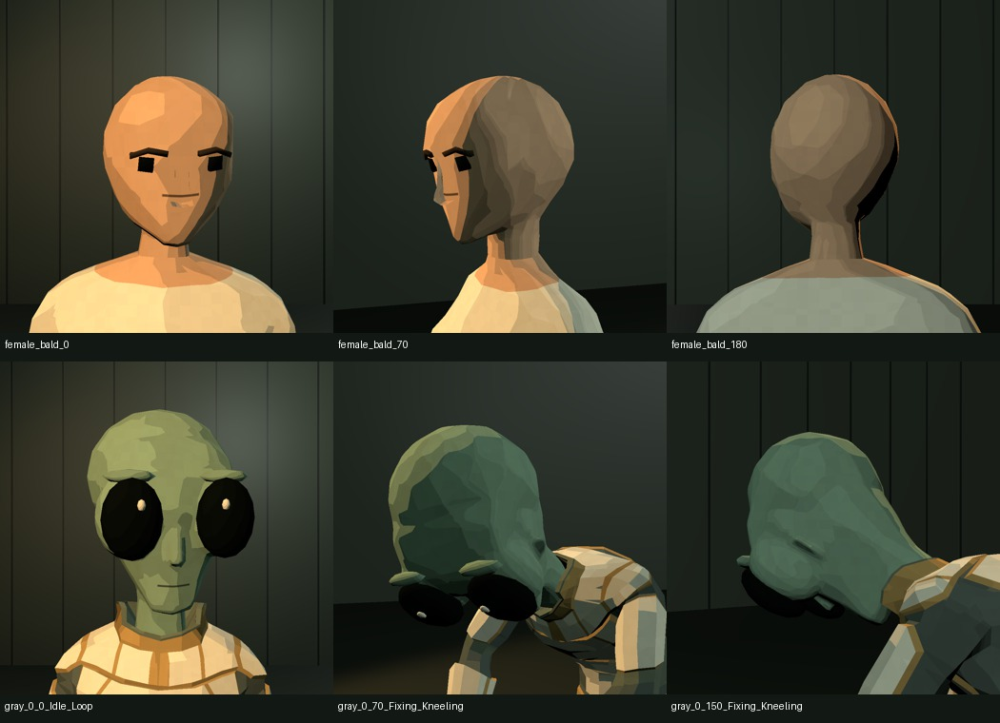
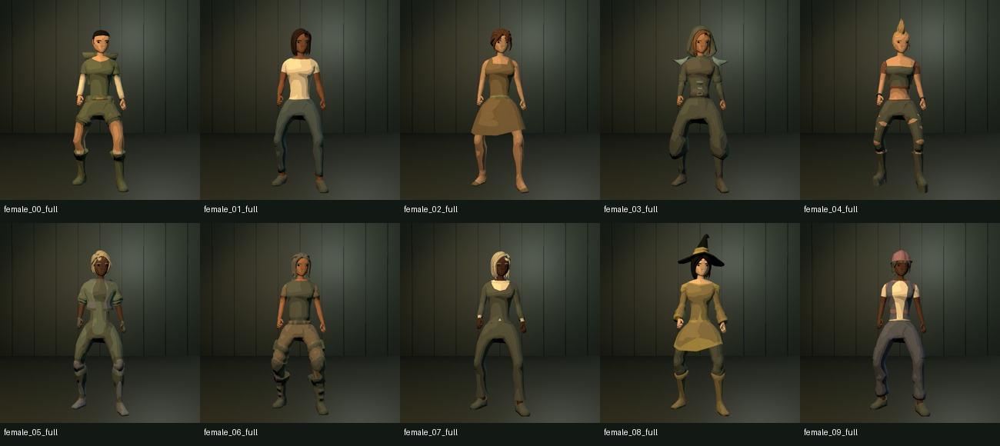

# 女性角色接入与灰裔头部修复

最新嘴部与发际线方案见 [下巴与发际线修复](下巴与发际线修复.md)，下方素材接入截图保留为历史记录。

适用版本：Tool/V2，2026-09-27。

## 从哪里使用

- 独立程序：`RunToolV2.cmd` → **＋ 新建人类 ▾ → 女性**。
- Unity 时间轴：**＋ 新建角色 → 人类 → 女性**。
- Unity 菜单：`Astra Performance Tool V2 → New character → Human → Female`。
- 人类角色可在 **身份 → 基本资料 → 人类底模** 切换男性／女性。切换会重置发型、衣装和面饰为适配款；不改变保存格式或动作系统。

女性预设在工作台的 **身份 → 预设角色** 中显示，按当前底模过滤。Unity 素材库的人类捏人预设中以“女性 · …”命名，可直接拖入人物轨。

## 新增内容

来自 [Quaternius Ultimate Modular Women](https://quaternius.com/packs/ultimatemodularwomen.html) 的 10 个角色：Adventurer、Casual、Formal、Medieval、Punk、SciFi、Soldier、Suit、Witch、Worker。

| 内容 | 当前范围 |
| --- | --- |
| 女性预设 | 10 个，支持编辑、保存角色资产和 Prefab |
| 上装／下装／鞋靴 | 各 10 个原包模块，可以分开选择，也可以整套应用 |
| 头部选择 | 14 项：无发、10 个原包发型／头饰组合、3 个适配帽盔 |
| 头部分级 | 短发束发、长发、帽饰；帽饰“无”恢复戴帽前的发型 |
| 服装分级 | 日常正装、科幻勤务、旅行长装 |
| 捏人参数 | 原有 10 脸型、眼睛、眉骨、鼻部、口部、脸宽、下颌、8 体型、肤色和配色 |
| 配件与纹样 | 女性专用面饰适配、共用装备、5 种皮肤纹样加“无” |
| 动作 | 沿用 42 个 UAL 动作，常用动作菜单与时间轴保持原路径 |

男性／外星人衣装与女性衣装使用各自分组。避免把两种静置体型的上装直接混穿；新增跨底模服装需要先在 Blender 内适配。

原包长发为蒙皮发束，没有新增布料或头发物理模拟。部分帽子与头发是原包整体组合，菜单将其归到帽饰。

## 本次修复

**灰裔嘴部。** 首次修复曾使用 UV2，后按要求恢复几何方案。现由 `Tools/face_geometry.py` 将收尖的口缝切入头部皮肤，口缝与周围皮肤共享边和顶点；没有独立悬空的小嘴，也不再加载嘴部贴图。六种口部选择与新下巴共同作用于连续网格。

**灰裔后脑。** 原下半脸与颅顶只是 Join 到一个对象，网格仍然相交。本次在 Blender 中对皮肤做体素融合、平滑过渡与减面，再恢复头／颈权重。皮肤只有一个连通分量，没有内部叠层。眼眶也融合进皮肤，眉骨重新贴合；保留独立眼球与低模整体轮廓。

**女性无发底模。** 原包省略了头发覆盖的后脑。实机旋转检查发现缺口后，沿原头皮边界补建颅顶并焊接，保留原脸部；发型只校正贴头底层与头皮的间距，保留发束埋入头内的原始发根；不再把每根发束的内侧顶点投射到额头。帽饰的基础法线与形态键法线保持一致，避免最大脸宽时出现错误三角阴影。

## 实现与数据兼容

- `ToolCharacterLook.humanModel`：0 为现有男性，1 为女性，仅对 Human 生效。旧 JSON 没有该字段时仍为 0；已有角色、服装和发型编号不移动。
- 模块总计 **200 个，共享 51 根骨骼**。新增 `Head_Female`、`Hair_Female_01`–`13`、`FaceAcc_Female_01`–`09`；女性衣装在共用衣装编号中占用 **22–31**。
- `Tools/import_women.py` 导入原始 glTF；按实际关节位置把静置网格适配到现有 Humanoid，将 Wrist／掌骨组映射到 Hand。不按 glTF 叶骨显示长度缩放头部，运行时不缩放单根骨骼。
- `Tools/female_scalp.py` 补全女性头皮；`Tools/fuse_gray_head.py` 融合灰裔皮肤；都在生成形态键之前执行。
- `Tools/face_details.py` 生成 UV2 颊纹和贴合配饰；`Tools/face_geometry.py` 生成几何口缝及独立下巴形态键。嘴部颜色来自网格材质与 ASTRA 色板。
- `ToolCharacterView` 统一选择模块、应用形态键和材质；工作台、Unity 编辑器、导出的 Prefab 使用同一路径。`ToolCharacterInstance` 在载入 Prefab 时恢复材质参数。

原始文件、许可证、固定镜像提交和逐文件 SHA-256 都在 `Source/Downloads/UltimateModularWomen/`。下载来源说明见 [THIRD_PARTY_NOTICES](../THIRD_PARTY_NOTICES.md)。新增资产编号与目录见 [资产扩充指南](资产扩充与目录指南.md)。

## 检查记录

- Blender 验证灰裔皮肤为单一封闭连通网格，女性新增头皮边界已经焊接。
- Unity 检查 46 个角色 × 42 动作 × 3 个采样点，共 **5,796 次姿态**；另检查女性 14 个头部选项 × 2 组脸宽／下颌极值 × 5 动作，共 **140 次混搭极值姿态**。
- 检查女性预设 Prefab 重新载入、女性外观 JSON、旧男性 JSON、摘帽恢复发型、菜单选项覆盖；后续版本已删除 12 张嘴部贴图，改验收几何口缝。
- 实际运行 Player，生成 **112 张有效角色截图**：10 女性角色的正面、侧面、背面、全身、低头维修与舞蹈；无发头型四角度；帽盔与面饰；灰裔六种嘴部三角度及低头动作。运行错误为 0。另有一张隐藏窗口的整屏 UI 截图为黑屏，不计入视觉验收；新建女性与发型分组已在可见窗口中单独检查。
- 实机截图用于视觉复查，姿态数值检查仅能发现无效坐标、网格爆开和骨骼比例问题，不能代替目视检查。

报告：`QA/tool-v2-verification.txt`、`QA/WomenAlien/editor-checks.txt`、`QA/WomenAlien/Runtime/result.txt`、`gray-topology.json`、`female-scalp.json`。

用户正在编辑的 `Unit_A_Archive.asset` 保持原样。回归测试只在临时副本中修正其未完成的演员引用；没有把这些测试修正写回示例资产。
