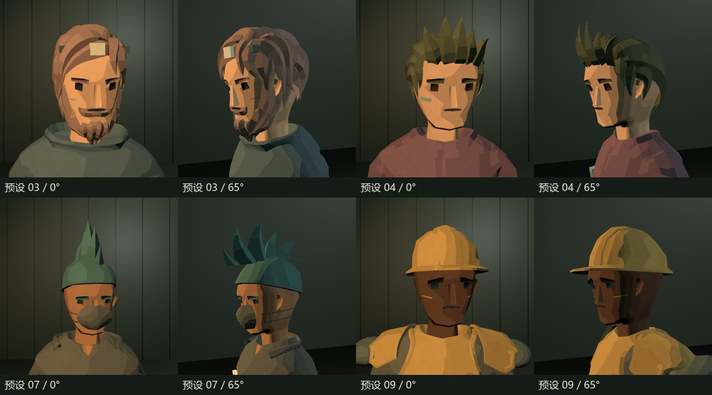
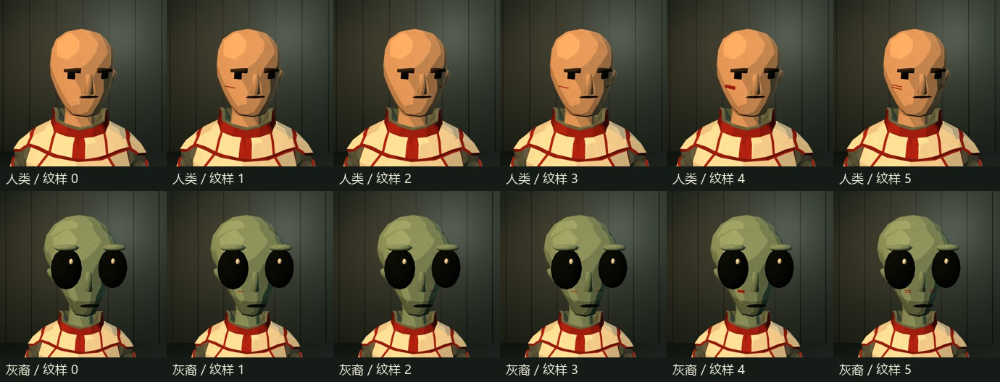
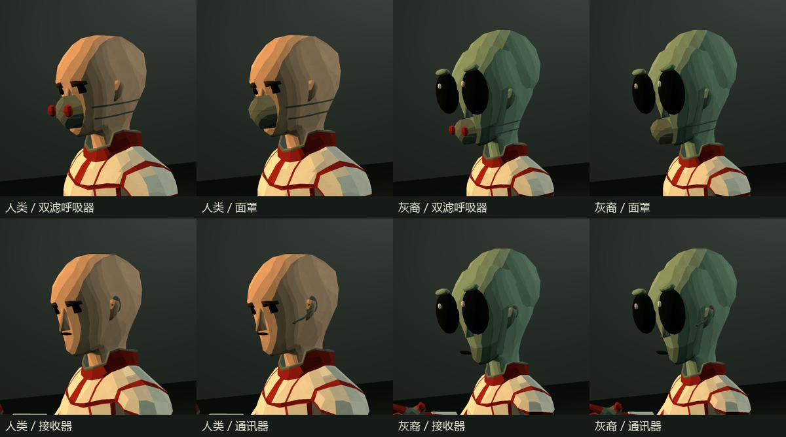

# 面部贴图、配件与时间轴修复

2026-09-27 · Tool/V2

## 这次改了什么

| 问题 | 原因与修改 | 操作位置 |
| --- | --- | --- |
| 脸颊上悬空的横条 | 原纹样是独立小网格，不能贴合各种脸型；现在移除这 10 个网格，在皮肤的独立 UV 通道上混合纹样贴图。灰裔纹样移到眼睛下方可见的脸颊。 | 装扮 → 纹样；配色 → 强调色 |
| 后脑旁的方盒 | 旧接收器是方块加长天线，位置和体积都不合适。4 号改为贴耳接收器，8 号改为带短麦克风的耳挂通讯器，旧编号继续有效。 | 装扮 → 面饰；选择“无”可卸下 |
| 面罩遮挡异常 | 5、7 号面饰改为连续低模外壳、贴脸弹性带，呼吸器增加两侧小滤芯；统一布面法线，修复长脸预设变形后的黑色三角条纹。 | 装扮 → 面饰 |
| 莫西干头皮闪烁 | 原头皮与通用头模型重叠；保留原包的高发束，替换下方头皮区域，共享头部变形。 | 头部 → 短发 → 莫西干 |
| 相邻片段难分辨 | 五条轨道的所有片段增加黑色边框；选中片段增加浅金色顶边。素材库列表改用浅色文字。 | 时间轴 |
| 帽子无法直接卸下 | 帽饰第一项增加“无”，恢复戴帽前的发型；该记录会随角色／外观 JSON 保存。 | 头部 → 帽饰 → 无 |
| 看起来只有 9 秒 | 9 秒是示例长度。现在常驻显示时长编辑栏，片段越界自动延长，并提供全览、缩放与秒数定位。 | 时间轴上方 |

纹样颜色沿用强调色，因此低对比度配色可能使细纹不显眼。额灯、眼镜、呼吸器和通讯器仍是实体配件，有各自用途；脸颊纹样本身没有厚度。

## 如何使用长演出

在“单元时长（秒）”输入 `120` 或 `3600` 并回车。“＋30秒”快速延长；“匹配内容”收至最后一个片段末尾；“全览”显示完整单元。通过“定位秒”跳到目标时刻，再放置片段。

移动／拉长片段、修改属性、把素材拖至末尾之后，都会自动延长单元。人物出场时间仍需覆盖动作时间，系统不会替策划延长人物片段。手动缩短单元不会截掉已有内容，应先缩短或删除尾部片段。没有人为设定的秒数上限，极端长度仍受浮点数和界面精度限制。

## 技术与资源位置

- `UnityProject/Assets/AstraToolV2/Resources/FaceMarks/`：人类、灰裔各 5 张 512×512 遮罩。黑色不着色，白色使用强调色。
- `Tools/face_details.py`：生成 UV、遮罩、面罩与通讯器；由 `Tools/build_modular.py` 调用。直接编辑 PNG 后执行模型重建会被生成器覆盖，长期修改应同步生成器或保留独立源文件。
- `Shaders/Character.shader`：使用第二套 UV 采样 `_FaceMarkTex`，仅在头部皮肤材质上启用。
- `Runtime/ToolCharacterView.cs`：为蒙皮头部设置纹样贴图与颜色。所有轮廓变化仍使用现有形态键与骨骼。
- `Runtime/ToolCreatorOptions.cs`：帽饰“无”与原发型恢复；`ToolData.cs` 增加 `hairUnderHat` 保存字段。
- `Editor/ToolTimelineEditing.cs`：单元长度、内容末尾和刻度间隔计算；`ToolV2TimelineWindow.cs` 负责编辑与绘制。

上面的 Unity 源码路径均相对于 `UnityProject/Assets/AstraToolV2`。模型仍是 51 根骨骼、原 Humanoid／UAL／Playables 管线；模块总数从 157 变为 147，差额是已删除的 10 个纹样网格。角色、发型、面饰和纹样编号保持兼容。特殊解剖外星人继续只显示已经适配的配件，通用纹样本轮覆盖人类与 0 号灰裔。

## 验证范围与证据

- Unity 编译、Windows Player 构建、Prefab 重建与 Unity 资源包导出。
- 41 项专项检查：10 张贴图、两种头部的 UV2、无旧纹样网格、帽饰摘戴与 JSON 往返、30／120／3600／86400 秒保存、五种轨道越界延长和缩短保护。
- 36 个角色 × 42 个动作 × 3 个采样点，共 4,536 次既有骨骼／动作检查。
- 运行时 132 组脸型／宽度／纹样状态；87 张实际 Unity 相机截图，覆盖用户指出的预设、两种物种的纹样、面罩和通讯器的多个角度与动作。
- 30 组纹样开关的图像比较：五种纹样在正面都有像素变化；背面与关闭纹样时一致，没有投到后脑。
- 实际操作 Unity 界面：相邻镜头黑框可辨；输入 120 秒后时长生效，全览能显示 120 秒末尾；“头部 → 帽饰”能戴宽檐帽，再选“无”恢复原短发。测试使用内存草稿。
- 运行时定位到 10／30／120.5／3599 秒，120.5 秒的台词正常出现。没有通过等待一小时来验证整段实时播放。

专项结果见 `QA/FaceTimeline/editor-result.txt`、`runtime-result.txt`、`paint-pixel-check.json`；完整动作检查见 `QA/tool-v2-verification.txt`。

这些截图用于检查代表性组合，不代表穷尽所有捏人参数组合。实际使用时仍可通过正面、侧面和动作试演复查自行搭配的外观。
