# ASTRA Performance Tool V2

### 像剪视频一样，编辑游戏里的角色演出<br>
### Edit in-game performances like a video timeline

<p align="center">
  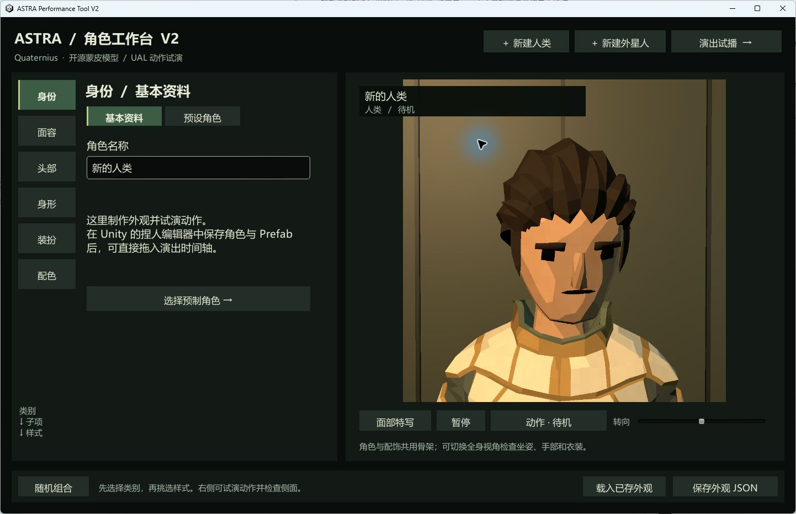
</p>

**ASTRA Performance Tool V2** 是一套面向游戏策划、叙事设计与小型开发团队的 Unity 演出创作系统。它把角色、动作、台词、镜头和场景变成可拖放、可裁切、可预览的时间轴片段，再用演出树组织选择、条件与结局——让一段游戏内对话或过场的制作方式，更接近大家熟悉的视频剪辑软件。

**ASTRA Performance Tool V2** is a Unity authoring system for game designers, narrative designers, and small development teams. It turns characters, animation, dialogue, cameras, and scenes into draggable, trimmable, previewable timeline clips, then connects choices, conditions, and endings in a performance graph—bringing game performance authoring closer to the familiar workflow of a non-linear video editor.

> 从“写一段逻辑、摆一个角色、调一个镜头”，变成“选择素材、编排时间、预览结果、交付演出”。<br>
> Move from scripting every beat by hand to selecting assets, arranging time, previewing results, and shipping a performance.

[中文介绍](#项目做了什么--what-this-project-does) · [English overview](#english-overview) · [快速开始 / Quick start](#快速开始--quick-start) · [技术架构 / Architecture](#技术原理--under-the-hood) · [AI 协作 / Human--AI](#人与-ai-共同创作--human--ai-co-creation)

---

## 项目做了什么 / What this project does

ASTRA 不是单纯的捏人工具，也不只是一个动画播放器。它覆盖了一段游戏演出从“角色准备”到“交互分支”，再到“导出进游戏”的完整制作链路：

ASTRA is more than a character creator or animation viewer. It covers the practical pipeline from preparing a cast, through interactive staging, to game-ready export:

- **创建演出角色 / Build a cast**：组合人类、女性与直立外星人的脸型、发型、颅冠、体型、服装、配件和配色，保存为正式 Unity 角色资产与 Prefab。
- **编排时间 / Arrange time**：在五轨时间轴上拖放人物、动作、台词、镜头和场景，移动或拉伸片段，并在同一窗口实时查看画面。
- **设计互动 / Design interaction**：用演出树连接普通演出、条件判断、全局选择和结束节点，支持选择超时、资源条件与不同结局。
- **从模板起步 / Start from templates**：一键生成单人来电、双人对话、交互问答、纯播报或空白演出，再继续自由编辑。
- **验证并交付 / Validate and deliver**：检查引用、覆盖时长、节点出口和结束路径；保存成套 Unity 资产，或把完整依赖导出到游戏工程。
- **让 AI 参与 / Bring in AI**：通过稳定的 JSON Schema 与本地 CLI，让 GPT / Codex 查询真实素材、生成或修改演出、校验分支、模拟结局，再由人类完成审美判断与最终验收。

## 像视频剪辑软件一样编辑演出 / A video-editor workflow for game performances

时间轴是 ASTRA 的核心工作界面。素材库在左、实时预览在中、参数检查器在右、轨道区在下；策划可以直接拖入素材，拖动片段改变出场时间，拉伸边缘改变时长，并用播放头定位任意时刻。长演出可以缩放全览与快速定位，动作切换会做短时混合，随机拖动播放头也能得到可复现的姿态。

The timeline is ASTRA's primary workspace: asset library on the left, live preview in the center, inspector on the right, and tracks below. Designers drag assets in, move clips to retime events, trim clip edges to change duration, and scrub to any moment. Long sequences can be zoomed and navigated; adjacent animations blend briefly, while manual sampling keeps scrubbing deterministic.

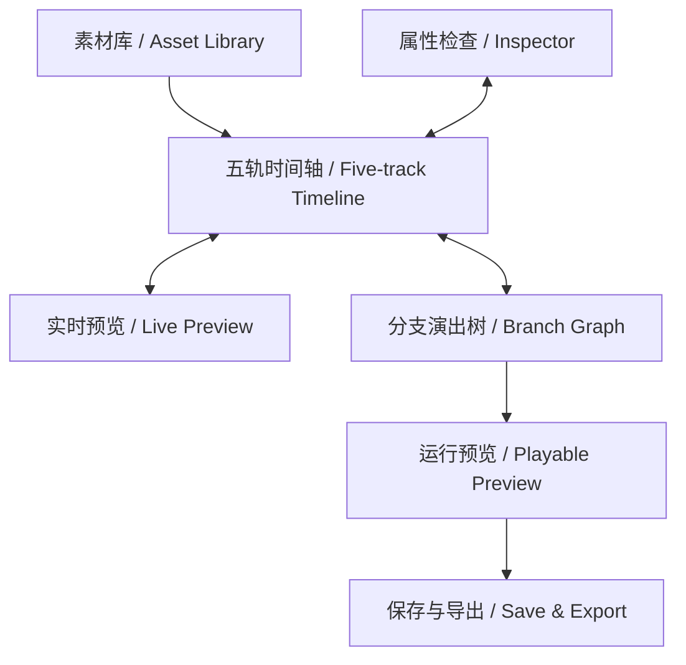

| 轨道 / Track | 编辑的内容 / What it controls | 典型用途 / Typical use |
| --- | --- | --- |
| 人物 / Cast | 角色、出场时段、演员 ID | 单人、双人或多人同场 |
| 动作 / Action | Humanoid 动画、起止时间、角色绑定 | 待机、说话、坐姿、维修、舞动等 |
| 台词 / Dialogue | 文本、说话人、选项、等待时间 | 字幕、问答、沉默出口 |
| 镜头 / Camera | 景别、目标角色、陪体、画面特效 | 中景、近景、双人、过肩、低机位等 |
| 场景 / Scene | 背景与覆盖区间 | 房间、终端、档案舱等演出空间 |

传统视频的时间轴通常只有一个固定结尾，游戏演出还需要响应玩家。ASTRA 因而把时间轴与**分支演出树**并列：每个时间轴单元都可以通向下一段、一个条件判断、一次全局选择，或明确的结束节点。时间负责“这一段如何演”，图负责“接下来演哪一段”。

A video timeline usually ends in one fixed result; a game performance must react to the player. ASTRA therefore pairs its timeline with a **branch graph**. A timeline unit can lead to another unit, a condition, a global choice, or an explicit ending. The timeline describes *how a beat plays*; the graph decides *which beat plays next*.

## 从角色到可播放演出 / From character to playable scene

<table>
  <tr>
    <td width="50%"></td>
    <td width="50%">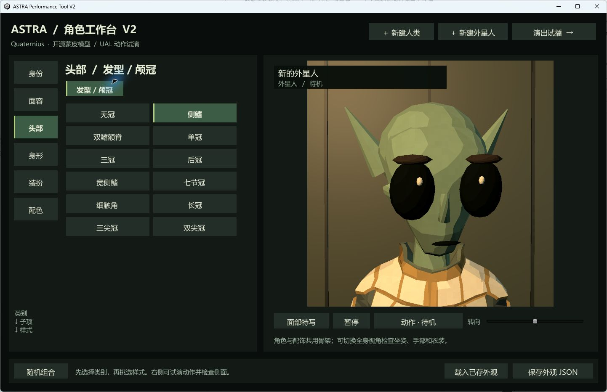</td>
  </tr>
  <tr>
    <td align="center"><sub>按用途选择、整套应用、推荐配色与动作检查<br>Category selection, full-set application, palette suggestions, and motion checks</sub></td>
    <td align="center"><sub>独立外星头型、颅冠和实时面部取景<br>Distinct alien heads, crests, and live portrait framing</sub></td>
  </tr>
</table>

项目包含一个可独立运行的角色工作台，也包含 Unity 内用于正式生产的角色编辑器。独立程序适合快速试搭配和保存外观 JSON；Unity 编辑器会把确认后的角色保存为 `ScriptableObject + Prefab`，直接进入人物素材库并拖入演出时间轴。

The project includes both a standalone character workbench and a Unity editor for production assets. The standalone build is ideal for quick visual exploration and appearance JSON; the Unity editor saves approved characters as `ScriptableObject + Prefab`, registers them in the asset library, and makes them immediately available to the performance timeline.

当前素材规模 / Current content:

- **42 个可编辑预设 / 42 editable presets**：16 男性、10 女性、16 外星人。
- **10 种人类脸型 + 10 种外星解剖头型 / 10 human faces + 10 distinct alien anatomies**。
- **33 个男性头部选项、14 个女性头部选项、12 个外星颅冠 / 33 male head options, 14 female head options, 12 alien crests**。
- **模块化服装 / Modular outfits**：人类男性与直立外星人各有 22 套上装、下装和鞋靴选项；女性底模有 10 套原包服装，可整套使用或自由混搭。
- **42 个实际动画片段 / 42 real animation clips**，默认素材栏展示 17 个高频语义动作。
- **9 个预设镜头 + 自定义镜头、3 个场景 / 9 preset shots plus custom shots, and 3 scenes**。

<p align="center">
  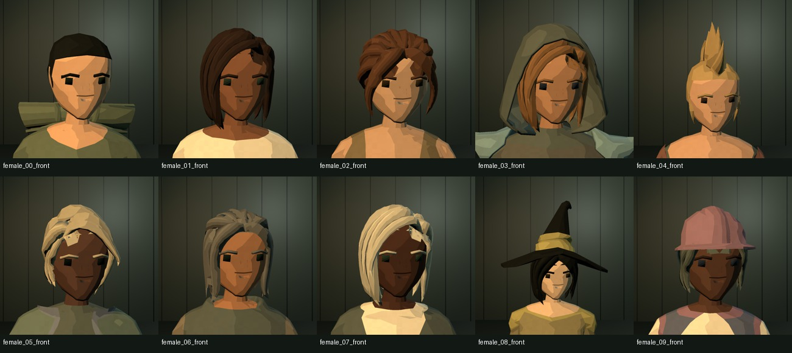
  <br><sub>女性角色发型、帽饰与肤色预设 / Female hair, headwear, and skin-tone presets</sub>
</p>

<p align="center">
  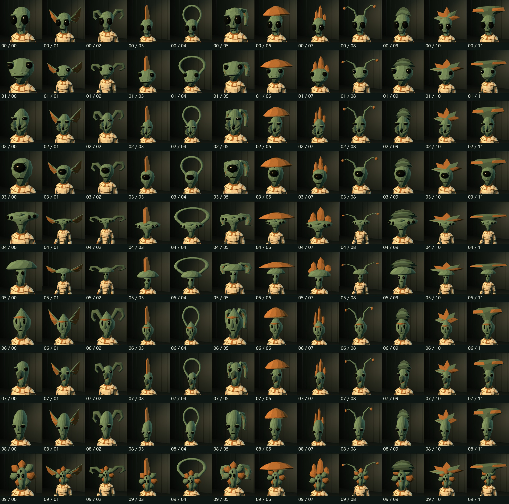
  <br><sub>十种解剖头型与十二种颅冠的组合检查 / Combination review across ten anatomies and twelve crest options</sub>
</p>

<p align="center">
  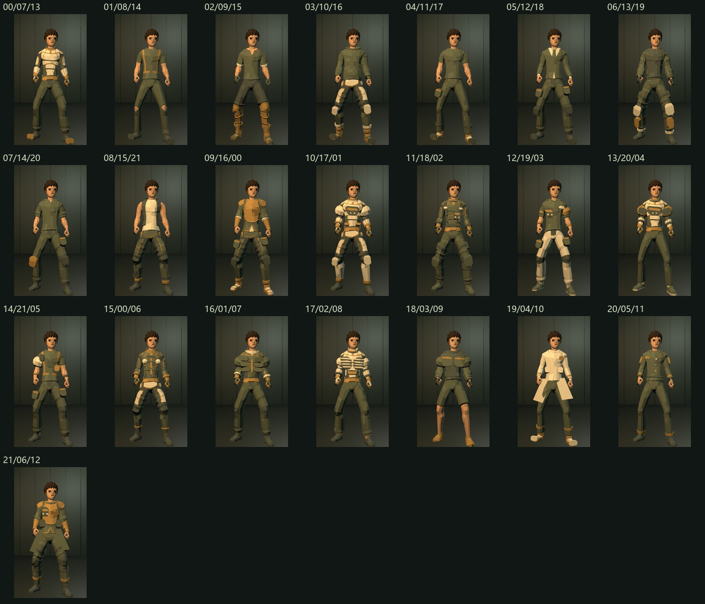
  <br><sub>上装、下装和鞋靴可独立组合 / Tops, bottoms, and footwear can be mixed independently</sub>
</p>

## 模板不是终点，而是第一版剪辑 / Templates are a first cut, not a cage

新建演出时，可以从四种常用结构或空白项目开始。模板会自动填充角色引用、动作、镜头、背景、台词时长和分支连线；生成后得到的仍然是普通演出数据，所有片段和节点都能继续编辑。

New performances can start from four production-ready structures or a blank project. Templates prefill cast references, animation, cameras, backgrounds, dialogue timing, and graph connections. The result remains ordinary editable performance data—every clip and node is still yours to change.

| 模板 / Template | 自动准备的内容 / Generated first cut |
| --- | --- |
| 单人来电 / Single Call | 开场、结束语、说话动作、单人中景与结束节点 |
| 双人对话 / Conversation | 两人站位、轮流台词、双人及过肩镜头 |
| 交互问答 / Interactive Question | 提问、两个选择、沉默超时、三种回应与结局 |
| 纯播报 / Broadcast | 单人播报、镜头、动作与自动结束 |
| 空白 / Blank | 空单元、入口和结束节点 |

<table>
  <tr>
    <td width="50%">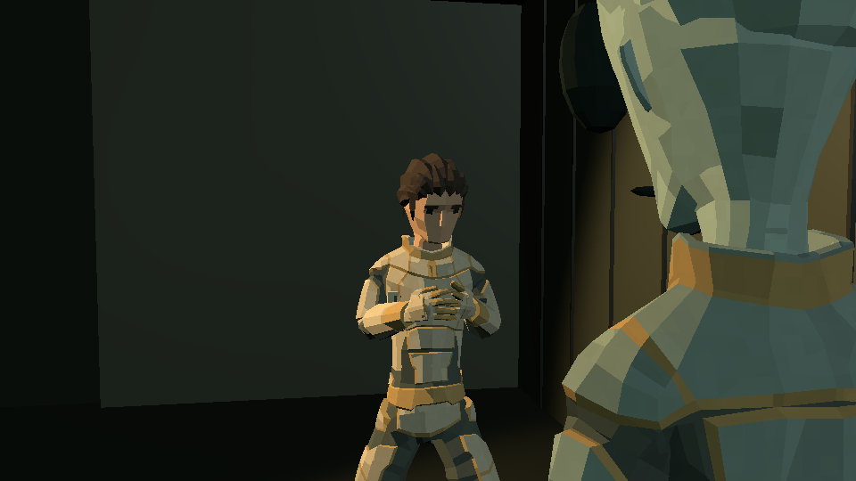</td>
    <td width="50%">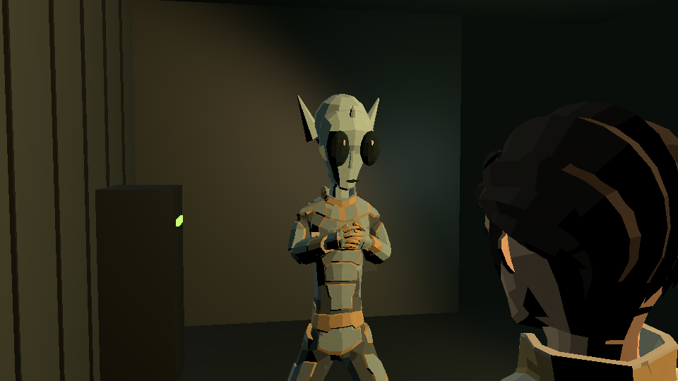</td>
  </tr>
  <tr>
    <td colspan="2" align="center"><sub>同一模板自动准备双人站位与正反打镜头 / One template prepares two-person blocking and shot–reverse-shot coverage</sub></td>
  </tr>
</table>

<table>
  <tr>
    <td width="33%"></td>
    <td width="33%">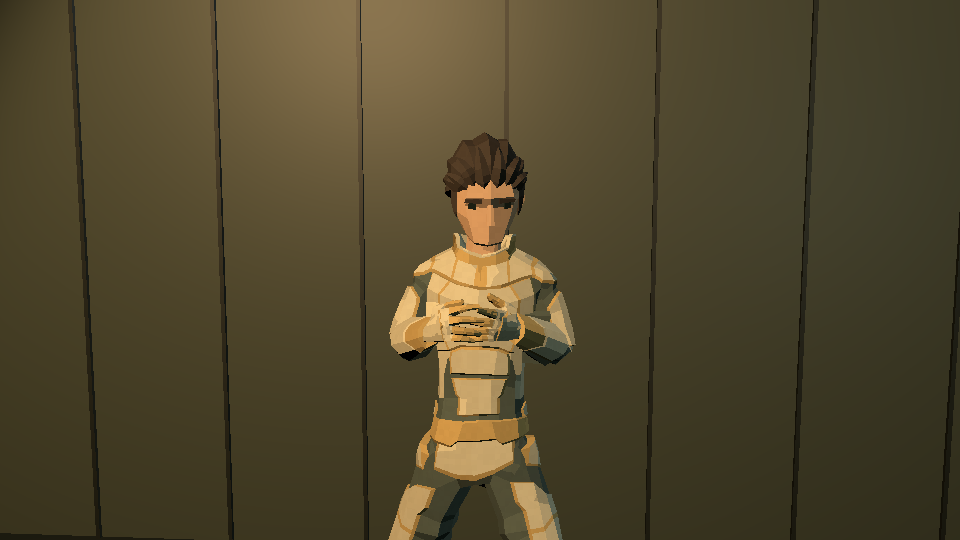</td>
    <td width="33%"></td>
  </tr>
  <tr>
    <td colspan="3" align="center"><sub>交互问答可连接选择、沉默超时、不同回应与结局 / Interactive questions connect explicit choices, silence timeouts, responses, and outcomes</sub></td>
  </tr>
</table>

## 一条完整的生产路径 / One continuous production path

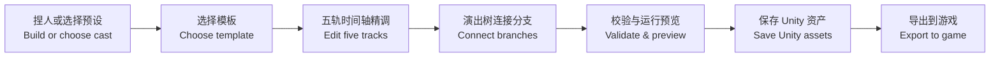

- **草稿 / Draft**：约每 3 秒自动保存到工程 `Library`，脚本重载或重开窗口后可恢复。
- **保存 / Save**：自动生成 Package、Graph 和 Units，无需在 Project 窗口逐个创建资产。
- **复制版本 / Version copy**：从已有演出复制出独立版本，公共角色和素材继续复用。
- **导出 / Export**：收集当前演出及依赖，生成可合并到目标游戏 Unity 工程的 `Assets` 目录。

## 人与 AI 共同创作 / Human × AI co-creation

ASTRA 也在探索一种更实用的人机协作方式：**AI 不绕过工具直接伪造 Unity 资产，而是使用与人类相同的素材目录、模板规则、校验逻辑和版本流程。**

ASTRA also explores a more practical model of human–AI collaboration: **the AI does not bypass the tool and fabricate Unity assets. It works through the same catalog, templates, validation rules, and versioned workflow used by human creators.**

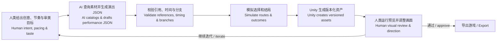

本地 CLI 提供 `doctor`、`catalog`、`template`、`inspect`、`validate`、`simulate`、`apply` 和 `export`。AI 可以先查询真实角色、动作、场景、镜头和特效，再生成版本化 JSON；之后复用 Unity 内的模板与逻辑进行精确校验和分支模拟。它不会覆盖既有演出，也不会偷偷修改策划正在编辑的草稿。

The local CLI exposes `doctor`, `catalog`, `template`, `inspect`, `validate`, `simulate`, `apply`, and `export`. An AI can query real characters, motions, scenes, shots, and effects before drafting versioned JSON, then reuse Unity's own templates and logic for validation and deterministic branch simulation. It does not overwrite existing performances or silently alter a designer's active draft.

这是一种明确分工的协作：

- **人类负责 / Humans own**：创意意图、角色表演、镜头语言、节奏、情感、最终画面判断。
- **AI 擅长 / AI assists with**：素材检索、初稿生成、批量改写、一致性检查、分支覆盖、版本化重复劳动。
- **工具守住边界 / The tool enforces**：真实资产引用、数据结构、可达性、时长覆盖、非破坏式写入和可追溯输出。

它的目标不是让 AI 取代游戏策划或动画师，而是把机械的查找、搭架子、校验和反复录入交给机器，让创作者把更多时间放在“这一幕为什么成立”上。

The goal is not to replace game designers or animators. It is to hand repetitive catalog lookup, scaffolding, validation, and data entry to machines, leaving creators more time to answer the question that matters: *why does this scene work?*

## English overview

ASTRA Performance Tool V2 is an end-to-end prototype for authoring interactive in-game performances in Unity. Its central idea is simple: narrative content should be editable with the immediacy of a video editor, without losing the branching logic that makes games interactive.

Designers can assemble modular characters, drag cast/action/dialogue/camera/scene clips onto a five-track timeline, scrub a live preview, connect units in a branching graph, start from reusable templates, validate the result, and export a self-contained dependency set into another Unity project. A schema-driven CLI gives AI assistants a safe way to inspect real project assets, draft or revise performances, simulate every response route, and create new versioned Unity assets. Humans remain in control of intent, staging, pacing, and visual approval.

The project is both a usable tool and a research direction: how can human judgment and machine assistance share one authoring system, and how much friction can be removed from game development without hiding or weakening creative control?

## 技术原理 / Under the hood

```text
Blender modular source
        ↓
ModularCast.fbx + shared 51-bone Humanoid rig
        ↓
Unity character assets / prefabs / motion catalog
        ↓
Five-track ToolUnit ── Branching ToolGraph ── ToolPackage
        ↓
Manual Playables sampling + live preview + ToolPlayer runtime
        ↓
Versioned assets / dependency export / game integration
```

### 角色与资产 / Characters and assets

- 模块在 Blender 中建模和绑定，导出后共享 51 骨骼 Humanoid；运行时只切换网格、BlendShape 与材质属性，不临时生成角色网格。
- 人类脸型形变会同步到头发、面饰和相关部件；外星人使用十种独立解剖头型，不是对同一灰裔头部做简单缩放。
- 正式角色由 `ToolCharacter`、外观配方与 Prefab 组成；`MaterialPropertyBlock` 避免为了换色复制整套材质。

### 动作与预览 / Motion and preview

- `ToolMotion` 使用手动更新的 Unity `PlayableGraph` 与两路 `AnimationMixer`。
- 时间轴采样会直接设置 clip time 并 `Evaluate(0)`，因此拖动播放头不依赖从头重放，结果可复现。
- 相邻动作在约 0.22 秒内混合；根运动关闭，场景走位由演出层控制。
- 角色编辑器、时间轴预览和运行时播放器复用同一套角色实例化、动作采样、站位与镜头逻辑。

### 数据、分支与交付 / Data, branching, and delivery

- `ToolUnit` 保存五轨片段，`ToolGraph` 保存 Unit、Condition、GlobalChoice 与 End 节点，`ToolPackage` 聚合演出和素材库。
- 校验覆盖素材引用、角色绑定、片段边界、出口目标、不可达节点与结束路径；逻辑模拟复用真实 `ToolLogic`。
- 正式资产使用 Unity `ScriptableObject`；AI 交换格式使用版本化 JSON Schema，避免直接维护 Unity YAML 或伪造 GUID。
- CLI 优先连接已打开的 Unity Editor，也可启动 batch；本地文件桥接不开放网络端口。

更详细的设计见 [技术架构](Docs/技术架构.md)、[捏人与演出设计](Docs/捏人与演出设计.md) 与 [演出 CLI 与代码调研](Docs/演出CLI与代码调研.md)。

## 快速开始 / Quick start

### 1. 先体验角色工作台 / Try the character workbench

在 Windows 上双击：

```text
RunToolV2.cmd
```

或直接运行：

```text
Build/ASTRA Performance Tool V2.exe
```

选择“新建人类”或“新建外星人”，在左侧编辑角色，在右侧转向、切换面部/全身视图并试演动作。独立程序可保存外观 JSON，适合快速探索；正式演出角色请在 Unity 编辑器中保存。

### 2. 在 Unity 中制作演出 / Author a performance in Unity

1. 双击 `OpenUnityV2.cmd`，或用 **Unity 2022.3.62f1** 打开 `UnityProject`。
2. 选择菜单 `Astra Performance Tool V2 → Open timeline`。
3. 点击“新建演出”，选择模板与角色；也可以从空白演出开始。
4. 把人物、动作、台词、镜头和场景拖入对应轨道，拖动播放头检查实时预览。
5. 打开“演出树”，连接选择、条件和结束节点。
6. 点击“验证”与“运行预览”，最后“保存”或“导出到游戏”。

完整操作见 [使用说明书](Docs/使用说明书.md)、[演出模板](Docs/演出模板使用说明.md) 和 [演出草稿与一键导出](Docs/演出草稿与一键导出.md)。

### 3. 让 AI / CLI 参与 / Add an AI or CLI workflow

CLI 使用 Python 3.9+ 标准库，无第三方 Python 依赖：

```powershell
python .\CLI\astra.py doctor
python .\CLI\astra.py catalog --out .\catalog.json
python .\CLI\astra.py template --kind Question --name "Outpost Help" --speaker "Assets/AstraToolV2/Characters/Original_Echo.asset" --params .\CLI\examples\question.params.json --out .\outpost.performance.json
python .\CLI\astra.py validate --input .\outpost.performance.json
python .\CLI\astra.py simulate --input .\outpost.performance.json --route accept
```

在让 GPT / Codex 修改演出前，请先让它阅读 [CLI 调用指南](CLI/agent-guide.md) 和 [JSON Schema](CLI/performance.schema.json)。CLI 不创建新模型、动画或配音，也不自动修改游戏星图、任务奖励或构建产物。

## 可复现构建 / Reproducible build

Git 克隆默认不包含 `Build` 和 `Export`。在本目录运行：

```powershell
.\Rebuild.ps1
```

需要从 Blender 源重新生成模块化模型时：

```powershell
.\Rebuild.ps1 -Models
```

可用 `-EditorPath` 和 `-BlenderPath` 指定本机工具位置。`Initialize` 用于首次导入或重建示例，会重设示例演出树与示例单元；日常角色和演出编辑不需要执行。

## 项目结构 / Repository map

| 路径 / Path | 内容 / Purpose |
| --- | --- |
| `UnityProject/Assets/AstraToolV2` | Runtime、Editor、角色、动作、示例、场景与演出资产 |
| `CLI` | 面向自动化与 AI 的 Python CLI、JSON Schema 和示例 |
| `Source` | Blender 源、原始资源、生成清单与来源记录 |
| `Tools` | 模块化模型与资产重建脚本 |
| `Build` | 可独立运行的 Windows 角色工作台 |
| `Export` | 可导入其他 Unity 工程的交付内容 |
| `QA` | 结构验证、运行日志、截图与视觉回归材料 |
| `Docs` | 使用说明、设计决策、技术架构与验收记录 |

## 当前边界 / Current boundaries

- 这是低多边形、模块化角色与演出系统，不是写实扫描头或任意拓扑编辑器。
- 当前新建角色面向人类与直立外星人；半兽人作为成品角色可用于演出，四足角色需按适用动作手动编排。
- 走路、慢跑等动画默认原地播放；精确走位、道具接触、IK、口型、配音与注视系统仍需由上层游戏或后续轨道实现。
- 分支模拟验证数据和逻辑，不等于画面验收；镜头构图、穿插、节奏和情感仍应在 Unity“运行预览”中由人检查。
- 导出会收集演出依赖，但不会替项目绑定星图事件、修改任务状态或自动构建游戏。

## 为什么做这个项目 / Why this project exists

游戏开发中，很多“看起来只是一段对话”的内容，实际横跨角色、美术、动画、镜头、文本、条件逻辑、资源管理与工程交付。若每次修改都需要多人来回传递、手写引用和重新验证，创作成本会迅速超过内容本身。

ASTRA 的探索，是把这些分散步骤收束成一个可视化、可验证、可自动化的创作系统：让策划像剪片一样直接组织演出，让程序提供稳定的运行与交付边界，也让 AI 在清晰的 Schema、真实素材和非破坏式版本控制之内承担重复劳动。

In game development, even “a simple conversation” crosses character art, animation, cameras, writing, conditions, asset management, and engineering delivery. When every revision requires manual references, cross-discipline handoffs, and repeated checks, coordination quickly costs more than the scene itself.

ASTRA explores a different workflow: bring those steps into one visual, verifiable, automatable authoring system. Designers edit performances with the directness of video; engineers define reliable runtime and delivery boundaries; AI handles repetitive work inside a real schema, real asset catalog, and non-destructive version process. The broader goal is not automation for its own sake, but **more creative iterations, lower coordination cost, and a more accessible path from an idea to a playable scene**.

## 文档与来源 / Documentation and attribution

- [完整使用说明 / User manual](Docs/使用说明书.md)
- [技术架构 / Technical architecture](Docs/技术架构.md)
- [资产扩充指南 / Asset extension guide](Docs/资产扩充与目录指南.md)
- [演出草稿与导出 / Drafting and export](Docs/演出草稿与一键导出.md)
- [终端会议接入 / In-game meeting integration](Docs/终端会议接入.md)
- [验收记录 / QA record](Docs/验收记录.md)
- [第三方来源与许可 / Third-party notices](THIRD_PARTY_NOTICES.md)

角色与动作素材的具体来源、许可和修改范围以 `THIRD_PARTY_NOTICES.md` 为准。

See `THIRD_PARTY_NOTICES.md` for the authoritative list of third-party assets, licenses, and modifications.
